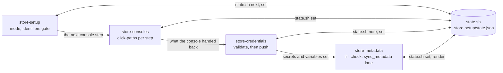

# Agent Skills

Agent skills that ship with this template, each under its own subdirectory.

- **native-setup**: Setting up a laptop or CI runner for Android and iOS (`make setup`), and the symptom → cause → fix table for toolchain, build and Maestro E2E failures.

The four store skills are:

- **store-setup**: The entry point. Picks the mode (guided, browser-pause, browser-full), keeps the resumable 49-step checklist in `.store-setup/state.json`, and holds the identifiers gate every console step waits on. The last eight steps are Huawei AppGallery, an optional extra store gated on `toggle-uploads`.
- **store-consoles**: The `apple-*`, `google-*` and `huawei-*` steps that can only happen inside App Store Connect, the Apple Developer portal, Google Play Console, Google Cloud or AppGallery Connect, as exact click-paths — driven in the browser or handed to the human.
- **store-credentials**: Creates and shape-validates every credential locally (the ASC API key, the match repo, the Android upload keystore, the Play service account JSON, the AppGallery Connect API client), then pushes each one to GitHub through stdin.
- **store-metadata**: Fills `fastlane/metadata`, places the images, writes the age-rating answers, and runs the `sync_metadata` lane. Apple and Google only — the AppGallery listing is console-only.

A worked example of the whole run, mode (a) start to finish, is
[`store-setup/references/walkthrough.md`](store-setup/references/walkthrough.md).

How they hand off. The checklist in `.store-setup/state.json` is the shared
thread: every skill reads the next step from it and records the result back,
which is what makes the whole run resumable and handed over mid-flight.



Each skill may have tests under `<skill>/tests/run.sh`. Run all tests offline with:

```bash
make check-skills
```

**Critical:** no skill file, and no file under `.store-setup/`, may hold a credential (API key, token, secret, password, certificate). `state.sh note` refuses credential-shaped keys outright — credentials go to `gh secret set` only, through stdin.
