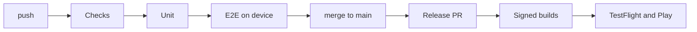

<div align="center">

# React Native Mobile Template

**Start on day ninety.**<br>
An Expo app with the signing, the pipelines, the emulators and the store
submissions already working.

[](https://github.com/blinkbitcoin/react-native-mobile-template/actions/workflows/ci.yml)
[](https://github.com/blinkbitcoin/react-native-mobile-template/actions/workflows/ci.yml)
[](https://github.com/blinkbitcoin/react-native-mobile-template/actions/workflows/ci.yml)

</div>

---

Every React Native project pays the same tax before it ships anything. Signing
that only fails on a Tuesday. An emulator that hangs in CI and nowhere else.
The eleventh linter. A release nobody remembers the order of. Months of it,
and none of it is your app.

This repo is that tax, already paid. Press **Use this template**, run `make
init`, and you get an app that builds, tests itself on real devices, and ships
to both stores from a merged pull request.



## Getting started

```sh
mise trust && mise install   # toolchain: Node, pnpm, Ruby, Java
make doctor                  # verify it (one line per tool)
make install                 # dependencies, gems, git hooks
make mock-api                # terminal 1: GraphQL mock API
make start                   # terminal 2: Metro for the dev client
make ios                     # or: make android
```

`make check && make unit` runs every gate CI runs. `make help` lists the rest.

> If a command is not in the Makefile, CI does not know how to run it either.
> That is the rule the whole repo is built on, and `make ci` is the whole of CI
> on your laptop.

<!-- init:usage-start -->
## Using this template

Press "Use this template" on GitHub, then run `make init`: it renames the
project, optionally drops the web target, and deletes itself. The full walkthrough
— what it asks, what it rewrites and what to do afterwards — is in
[docs/template-usage.md](docs/template-usage.md).
<!-- init:usage-end -->

## The opinions

#### `ios/` and `android/` are build output

Continuous Native Generation. Native config is a TypeScript plugin, not a diff
someone applied to an Xcode project two years ago and cannot explain.
`make prebuild` regenerates both. You commit neither.

#### CI is a dependency, not a directory

The workflows live in
[`blinkbitcoin/react-native-workflows`](https://github.com/blinkbitcoin/react-native-workflows),
pinned here at `@v0`. What is left in this repo is eleven short files naming
which ones to run. A fix to the Android emulator boot lands once, for every app
in the family.

#### Every gate is a `make` target

CI runs `make`. So a red build is reproducible from the job name, and a new
gate is one Makefile line instead of a YAML negotiation.

#### The release path runs without store credentials

Builds go unsigned. Signing switches on with a repo variable, uploading with
another. You can watch a release work end to end before Apple has answered your
email.

## What's inside

| Area | What you get |
| --- | --- |
| App | Expo SDK 57, React Native 0.86, expo-router routes, a themed component kit |
| Data | Apollo Client 4 with retry/auth/error links, a persisted cache, generated typed documents |
| i18n | Lingui 6, `en` + `es` catalogs, extraction and drift checks |
| Native | A local Expo module (`modules/hello-native`) and a config plugin (`plugins/with-build-stamp.ts`) |
| Config | `zod`-parsed `EXPO_PUBLIC_*` env, per-environment `.env` files, a secret-leak gate |
| Tests | Jest + RNTL unit/component, `node:test` for scripts, Maestro on device, Playwright on web |
| Quality | Biome, ESLint, TypeScript, knip, typos, shellcheck, actionlint — all behind `make check` |
| Release | fastlane lanes for both stores, match signing, artifact verification, store notes, `DRY_RUN=1` rehearsal |
| OTA | expo-updates behind an `OTA_ENABLED` toggle, code signing, a self-hosted update server |

## Shipping

Merge a pull request and release-please opens the version PR. Merge that, and
the tag, the signed builds, the artifact verification, the GitHub release and
the TestFlight and Play submissions all happen without anyone typing a command.
Beta promotion and the staged production rollout are one dispatch each, and a
bad rollout is halted the same way.

[**Release runbook**](docs/release-runbook.md) is the whole path, including how
to rehearse it. [**Store accounts**](docs/store-accounts.md) covers getting the
accounts and credentials in the first place — Apple, Google, Huawei, Samsung.

## Documentation

[docs/README.md](docs/README.md) says which page answers which question. Two to
start with: [**local-dev**](docs/local-dev.md) to get the app running,
[**architecture**](docs/architecture.md) for how it is laid out. `AGENTS.md` is
the rules-of-the-road file, for humans and coding agents alike.

## Licence

MIT — see [LICENSE](LICENSE).
