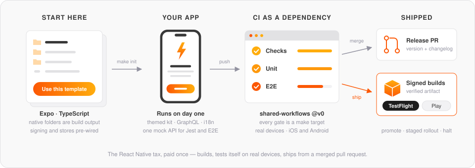
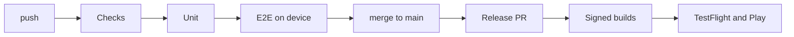

<div align="center">

# React Native Mobile Template

The starting point for a new React Native app: an Expo project with the
signing, the pipelines, the emulators and the store submissions already
working.

[](https://github.com/blinkbitcoin/react-native-mobile-template/actions/workflows/ci.yml)
[](https://github.com/blinkbitcoin/react-native-mobile-template/actions/workflows/ci.yml)
[](https://github.com/blinkbitcoin/react-native-mobile-template/actions/workflows/ci.yml)
[](LICENSE)

<sub>Badges are per branch — these are `main`'s. See <a href="docs/ci.md#badges">CI</a>.</sub>

</div>

---

<p align="center">
  
</p>

Every React Native project pays the same tax before it ships anything. Signing
that only fails on a Tuesday. An emulator that hangs in CI and nowhere else.
The eleventh linter. A release nobody remembers the order of. Months of it,
and none of it is the app itself.

That tax is paid here once. Press **Use this template**, run `make init`, and
the result is an app that builds, tests itself on real devices, and ships to
both stores from a merged pull request.



**Where to start.** Three ways through this repository:

- **Starting a new app** — [Getting started](#getting-started) to run it, then
  [Using this template](#using-this-template) for what `make init` rewrites and
  [local-dev.md](docs/local-dev.md) for the long version.
- **Working in the app** — [What is in here](#what-is-in-here) maps every
  directory, [architecture.md](docs/architecture.md) covers data flow,
  providers and env, [quality.md](docs/quality.md) says which linter owns
  which rule.
- **Shipping it** — [The pipelines](#the-pipelines) lists every workflow and
  job, [release-runbook.md](docs/release-runbook.md) is how to cut, promote,
  roll out and halt, [store-accounts.md](docs/store-accounts.md) is the
  accounts and credentials.

## Getting started

```sh
mise trust && mise install   # toolchain: Node, pnpm, Ruby, Java
make doctor                  # verify it (one line per tool)
make install                 # dependencies, gems, git hooks
make mock-api                # terminal 1: GraphQL mock API
make start                   # terminal 2: Metro for the dev client
make ios                     # or: make android
```

`make check && make unit` runs every gate CI runs. `make help` lists the rest.

> If a command is not in the Makefile, CI does not know how to run it either.
> That is the rule the whole repo is built on, and `make ci` runs the whole of
> CI locally.

<!-- init:usage-start -->
## Using this template

Press "Use this template" on GitHub, then run `make init`: it renames the
project, optionally drops the web target, and deletes itself. The full walkthrough
— what it asks, what it rewrites and what to do afterwards — is in
[docs/template-usage.md](docs/template-usage.md).
<!-- init:usage-end -->

## The opinions

#### `ios/` and `android/` are build output

Continuous Native Generation. Native config is a TypeScript plugin, not a diff
someone applied to an Xcode project two years ago and cannot explain.
`make prebuild` regenerates both. Neither is committed.

#### CI is a dependency, not a directory

The workflows live in
[`blinkbitcoin/shared-workflows`](https://github.com/blinkbitcoin/shared-workflows),
pinned here at `@v0`. What is left in this repo is eleven short files naming
which ones to run. A fix to the Android emulator boot lands once, for every app
in the family.

#### Every gate is a `make` target

CI runs `make`. So a red build is reproducible from the job name, and a new
gate is one Makefile line instead of a YAML negotiation.

#### The release path runs without store credentials

Builds go unsigned. Signing switches on with a repo variable, uploading with
another. A release can be watched end to end before the store accounts exist.

## What is in here

| Path                | Responsibility                                                                       |
| ------------------- | ------------------------------------------------------------------------------------ |
| `src/app/`          | expo-router routes. A file here is a screen; nothing else is                         |
| `src/components/`   | The themed component kit, each with its own test                                     |
| `src/features/`     | Feature modules — the screens' actual logic, kept out of the route files             |
| `src/graphql/`      | Queries and mutations, plus the typed documents codegen writes from them             |
| `src/config/`       | `zod`-parsed `EXPO_PUBLIC_*` env. Nothing reads `process.env` directly               |
| `src/i18n/`         | Lingui setup and the `en` and `es` catalogs                                          |
| `src/theme/`        | Design tokens, colours and typography                                                |
| `src/lib/`          | Shared helpers that belong to no single feature                                      |
| `src/services/`     | The Apollo client and its retry, auth and error links                                |
| `modules/`          | A local Expo native module (`hello-native`) — the worked example of native code      |
| `plugins/`          | Config plugins. `with-build-stamp.ts` shows the pattern: native config as TypeScript |
| `fastlane/`         | `Fastfile` plus one lane file per platform, store metadata, `Matchfile` for signing  |
| `scripts/`          | Every gate and helper `make` calls, with `node:test` files next to them              |
| `mocks/`            | The GraphQL mock API — one schema, served to Jest via MSW and to E2E as a server     |
| `.maestro/`, `e2e/` | Maestro flows for device E2E, Playwright specs for web                               |
| `assets/`           | Icons, splash screens and fonts                                                      |
| `certs/`            | The public OTA code-signing certificate. Never a private key                         |
| `deploy/`           | Deployment for the self-hosted update server                                         |
| `docs/`             | Twelve pages, indexed by question in [docs/README.md](docs/README.md)                |

Not in here, deliberately: `ios/` and `android/`. They are generated.

## The pipelines

Eleven workflow files. Each is a thin caller —
[`shared-workflows`](https://github.com/blinkbitcoin/shared-workflows)
holds what they actually do. Job names are what the Actions graph shows.

**CI** — on a pull request and on `main`

| Workflow        | Jobs                                    | Fires on                                                                            |
| --------------- | --------------------------------------- | ----------------------------------------------------------------------------------- |
| `ci.yml`        | `Checks`<br>`Unit`<br>`E2E`<br>`Badges` | Push, PR, dispatch. Each job gates the next, so a failed unit run never reaches E2E |
| `codeql.yml`    | `Analyze`                               | Push, PR, weekly. Informational, never a required check                             |
| `web.yml`       | `Export`                                | PR and release — the web export and Playwright suite                                |
| `pr-title.yml`  | `Title`                                 | Conventional Commits on the PR title                                                |
| `pr-closed.yml` | `Cleanup`                               | Cancels the closed PR's runs, drops its badges                                      |

**CD** — on a merge, a release, or a deliberate dispatch

| Workflow                 | Jobs                                                                                                                                         | Fires on                                                                              |
| ------------------------ | -------------------------------------------------------------------------------------------------------------------------------------------- | ------------------------------------------------------------------------------------- |
| `release-please.yml`     | `Release PR`                                                                                                                                 | Push to `main`. Maintains the version PR; dispatches beta and web at a cut release                                              |
| `release-internal.yml`   | `Prepare`<br>`Build iOS`<br>`Build Android`<br>`Upload iOS`<br>`Upload Android`<br>`GitHub Pre-release`<br>`OTA`                             | Push to `main`, once CI is green for that sha. TestFlight and the Play internal track |
| `release-beta.yml`       | `Prepare`<br>`Promote iOS`<br>`Promote Android`<br>`GitHub Release`<br>`Store Notes`<br>`OTA`                                                | Dispatched by `release-please.yml` at the tag. Promotes the internal build rather than rebuilding              |
| `release-production.yml` | `Prepare`<br>`Release iOS`<br>`Release Android`<br>`Phased iOS`<br>`Rollout Android`<br>`Halt Android`<br>`GitHub Release`<br>`OTA`<br>`Web` | Dispatch only, carrying the action. Phased release and staged rollout, with a halt    |
| `release-retry.yml`      | `Retry Beta`                                                                                                                                 | A failed beta run. Retries it without a human                                         |
| `ota-hotfix.yml`         | `Baseline` · `Publish`                                                                                                                       | Dispatch. Ships JS without a store round trip, gated on the native fingerprint        |

## Shipping

Merge a pull request and release-please opens the version PR. Merge that, and
the tag, the signed builds, the artifact verification, the GitHub release and
the TestFlight and Play submissions all happen without anyone typing a command.
Beta promotion and the staged production rollout are one dispatch each, and a
bad rollout is halted the same way.

[**Release runbook**](docs/release-runbook.md) is the whole path, including how
to rehearse it. [**Store accounts**](docs/store-accounts.md) covers getting the
accounts and credentials in the first place — Apple, Google, Huawei, Samsung.

## Documentation

[docs/README.md](docs/README.md) says which page answers which question. Two to
start with: [**local-dev**](docs/local-dev.md) to get the app running,
[**architecture**](docs/architecture.md) for how it is laid out. `AGENTS.md` is
the rules-of-the-road file, for humans and coding agents alike.

## Licence

MIT — see [LICENSE](LICENSE).
