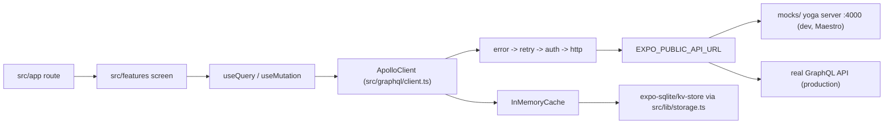

# Architecture

An Expo SDK 57 app with Continuous Native Generation. There is no `ios/` or
`android/` directory in git: both are generated by `expo prebuild` from
`app.config.ts` and the config plugins, and both are gitignored. Everything
below follows from that.

## Folder map

| Path | Holds | Notes |
| --- | --- | --- |
| `src/app/` | Expo Router routes | File-based routing. Routes only compose screens (see below) |
| `src/features/` | Screen-level feature code | `HomeScreen`, `DetailsScreen`, `SettingsScreen`, the dev menu, the native demo card |
| `src/components/` | Shared presentational components | `AppText`, `Button`, `Card`, `Screen`, `ErrorFallback`, `Providers` |
| `src/graphql/` | Apollo client, cache, links, generated documents | `generated/` is written by `make codegen` and is never edited by hand |
| `src/services/` | Cross-feature runtime services | `auth.ts`, `updates.ts` |
| `src/lib/` | Thin wrappers over platform APIs | `logger`, `secure-store`, `storage`, `errors`, `crash-reporting`, `native-intent` |
| `src/config/` | Build and runtime configuration | `env.ts` (zod-validated), `constants.ts` (build metadata) |
| `src/theme/` | Tokens, `ThemeProvider`, `createStyles` | Plain `StyleSheet`, no styling framework |
| `src/i18n/` | Lingui setup and compiled catalogs | `locales/**/messages.ts` is generated |
| `src/test/` | Jest harness | `render.tsx`, `setup.ts`, `env.ts`, module mocks |
| `modules/` | Local Expo modules | `hello-native` proves the JS to Swift/Kotlin path |
| `plugins/` | Config plugins | Build stamp, Android release signing, Android release ABIs |
| `mocks/` | The mock GraphQL API | One executable schema served by graphql-yoga and by MSW |
| `scripts/` | Checks, doctor, e2e runners, release tooling | Called by the Makefile and by CI |
| `fastlane/` | Store lanes and metadata | Exercised locally by `make check-release` |
| `.maestro/` | E2E flows | Ordered explicitly in `.maestro/config.yaml` |
| `e2e/web/` | Playwright web smoke | Web only |

## The routes-only rule

Files under `src/app/` compose screens from `src/features` and
`src/components`. They may not import `@apollo/client`, `@/graphql/**`,
`@/services/**` or `@/lib/**` (relative forms of the same paths included).

This is enforced, not advisory: `biome.json` has an override on `src/app/**`
that turns those import paths into an error under
`style/noRestrictedImports`. Two files are exempt from those patterns, by a second override:

| Exempt file | Why |
| --- | --- |
| `src/app/_layout.tsx` | It mounts `Providers` and installs the global error handler |
| `src/app/+native-intent.tsx` | It maps an incoming deep link through `@/lib/native-intent` before routing |

Two more restricted imports apply everywhere in the app: `expo-secure-store`
must go through `src/lib/secure-store.ts`, and `expo-sqlite/kv-store` through
`src/lib/storage.ts`. Those two restrictions hold in `src/app/` as well,
including in the two exempt route files. Only the wrappers themselves and the
test mocks are allowed to import them directly.

## Data flow



`createApolloClient` composes the link chain in that order:
`createErrorLink()`, `RetryLink` with three attempts, `createAuthLink()`, then
`HttpLink`. The cache is an `InMemoryCache` that is restored on mount and
written back when the app goes to background or inactive
(`src/graphql/cache.ts`). A corrupt snapshot is logged and dropped, never
fatal.

Jest and the Playwright suite talk to the same schema through MSW instead of
the yoga server. See `mocks/README.md`.

## Config and env flow

Two separate channels, and mixing them is the classic mistake.

| Channel | Read by | Reaches the JS bundle |
| --- | --- | --- |
| `EXPO_PUBLIC_*` | `src/config/env.ts` | Yes, inlined at build time, visible to users |
| Everything else | `app.config.ts`, CI, fastlane | No |

`app.config.ts` reads build-time variables and derives the native config:

| Variable | Effect |
| --- | --- |
| `APP_VARIANT` | `production` or (default) `development`. Picks the app name and suffixes the bundle id and package with `.dev` |
| `APP_VERSION` | `version`, and so `CFBundleShortVersionString` / `versionName`. Defaults to `0.0.0` |
| `APP_BUILD_NUMBER` | iOS `buildNumber` and Android `versionCode`. Defaults to `1` |
| `IOS_BUNDLE_ID`, `ANDROID_PACKAGE` | Identity. Both default to `com.example.rnmt` |
| `OTA_ENABLED` | `true` compiles the `updates` block in. Anything else compiles `updates: { enabled: false }` |
| `EXPO_UPDATES_URL` | The update server origin, only used when OTA is on |
| `GITHUB_SHA` | Feeds the build stamp (`<variant>-<sha7>-<date>`) |
| `EXPO_PUBLIC_WEB_DOMAIN` | Adds the iOS associated domain and the Android app-link intent filter |

`extra` carries `variant`, `otaEnabled` and `buildStamp` into the app;
`src/config/constants.ts` reads them back through `expo-constants`, together
with the version and build number.

`src/config/env.ts` validates the public variables with zod and fails closed:
a missing `EXPO_PUBLIC_API_URL` or `EXPO_PUBLIC_APP_NAME` throws at import time
with a message naming `.env.development` / `.env.production`. It also rewrites
`://localhost` to `://10.0.2.2` when running in dev on Android, because the
emulator sees the host machine at that address. The property accesses are
static on purpose: Expo only inlines `process.env.EXPO_PUBLIC_X` when it is
written out literally.

`.env.example` documents every name, public and build-time.

## Provider order

`src/components/Providers.tsx` is the one provider stack, and the test harness
(`src/test/render.tsx`) mounts the same component, so the tree under test is
the tree that ships.

```
ThemeProvider
  I18nProvider
    ErrorBoundary (FallbackComponent = ErrorFallback)
      ApolloProvider
        children
```

The boundary sits inside Theme and I18n because its fallback uses both, and
outside Apollo so a failure in the client is still caught. Tests pass
`withErrorBoundary={false}` so a render error fails the test loudly instead of
quietly rendering the fallback.

## Error handling

| Layer | What catches it | Where it goes |
| --- | --- | --- |
| Render errors | `ErrorBoundary` in `Providers` | `ErrorFallback` UI, plus `crashReporting.captureException` |
| Errors outside React | `ErrorUtils.setGlobalHandler` in `src/app/_layout.tsx` | `crashReporting.captureException` with `isFatal`, then the previous handler |
| GraphQL errors | `createErrorLink` in `src/graphql/links/error.ts` | A warning through `logger`. An `UNAUTHENTICATED` extension also notifies `onUnauthenticated` subscribers, which is how `src/services/auth.ts` signs the user out |
| Network errors on an operation | the same link | `logger.error` plus `crashReporting.captureException` with the operation name |
| Anything user-facing | `toUserMessage` in `src/lib/errors.ts` | One of three copy strings, keyed by the `AppError` code `NETWORK`, `UNAUTHENTICATED` or `UNKNOWN` |

The global handler chains to the previous one, so the red box in development
and the process termination in release both survive. `crashReporting` is a
no-op adapter until you wire a reporter: see
[ota-and-crash-reporting.md](ota-and-crash-reporting.md).

## Storage split

| Wrapper | Backend | For |
| --- | --- | --- |
| `src/lib/secure-store.ts` | `expo-secure-store` (Keychain, Keystore) | Secrets. Keys come from the `SecureKey` enum, values are capped at 2048 bytes |
| `src/lib/storage.ts` | `expo-sqlite/kv-store` | Non-secret JSON key/value data, including the Apollo cache snapshot |

Secure storage has no real web backend. On web the wrapper throws
`UnsupportedPlatformError` unless `EXPO_PUBLIC_ALLOW_INSECURE_WEB_STORAGE` is
`true`, in which case it falls back to an in-memory map for local development
only.

## Updates channel model

`runtimeVersion` is `{ policy: 'fingerprint' }`, so the runtime version is the
native fingerprint and a binary is only ever offered updates built from a
matching native layer.

There is one binary, promoted internal to beta to production, and it bakes the
`expo-channel-name: production` request header. `src/services/updates.ts`
exposes `updates.info()`, a throttled `applyIfAvailable()` (once an hour, and
never in `__DEV__`), and `switchChannel()`, which overrides that header at
runtime for dev and QA only. The override is per install and does not survive a
reinstall. Full detail in [ota.md](ota.md).
