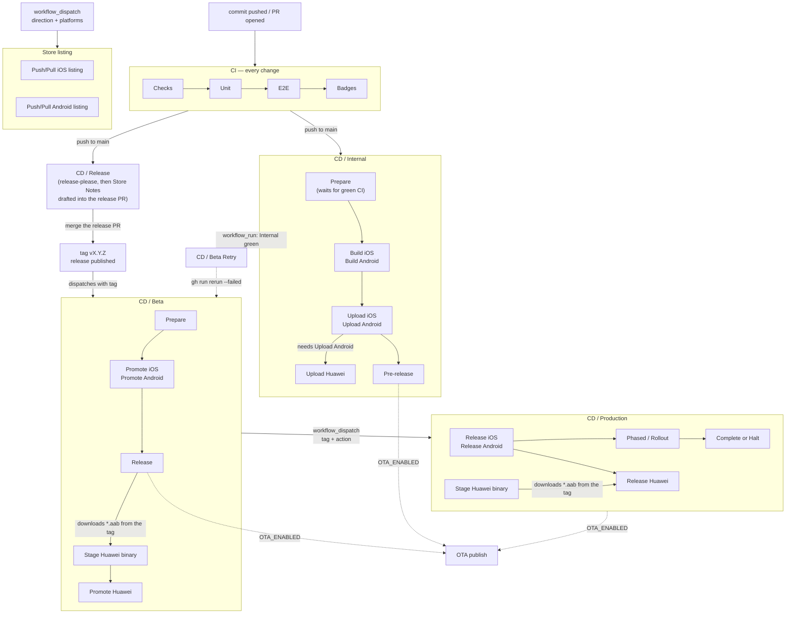

# CI

This repo runs almost no CI logic of its own. Nearly every job lives in
[`blinkbitcoin/shared-workflows`](https://github.com/blinkbitcoin/shared-workflows)
and the twelve files in `.github/workflows/` are thin callers that pick inputs.
Two of the twelve are the exception and are described below. The workflows repo's
`docs/consumer-guide.md` is the contract; this page is the template's half of
it.

## The callers

Twelve files, in two groups: five that run on every change, and seven that make
releases. The release group is documented in
[release-runbook.md](release-runbook.md) and [ota.md](ota.md); the table below
is the inventory.

The whole flow, with the **event** that crosses each boundary. Those labels are
the point: a GitHub run is created per event, not per file, so the Actions UI
can only ever show you one of these boxes at a time. That is also why these are
separate workflows rather than one — merging them would produce the same runs
with most jobs skipped.



Two edges are worth reading twice. `Prepare` in **CD / Internal** waits for CI
to conclude green for the same commit, so a red `main` never reaches a build or
a store. And `E2E` sits behind `Unit`, so a failed unit run never pays for a
twenty-minute Android suite or a macOS runner.

The Huawei AppGallery jobs hang off the Google Play ones on purpose: each of
them `needs` its tier's Android store job, so AppGallery never receives a
bundle Play refused and is never the only store holding one. Internal uploads
the bundle this run just built. Beta and production have no bundle in the run
at all, so `Stage Huawei binary` downloads the `*.aab` back off the release tag
with `gh release download` and re-uploads it as an artifact the lane then
reads — AppGallery has no promote endpoint, so every tier is a fresh upload
with different submission flags. All five Huawei jobs are behind
`HUAWEI_UPLOADS_ENABLED` on top of `STORE_UPLOADS_ENABLED`.

**CD / Beta Retry** is not in the release chain; it is the repair for one
timing hole. A beta run refuses to promote until that commit's internal run is
green, and `release-please` dispatches beta exactly once, so a beta dispatched
while internal is still building (or red) fails at the gate with nothing left
to re-trigger it. `release-retry.yml` listens for `workflow_run` on a completed
**CD / Internal** for `main`, and when the conclusion is `success` it finds a
concluded-but-not-successful `release-beta.yml` run for the same head commit
and does `gh run rerun --failed` on it — only the jobs that failed, so nothing
promotes twice. It matches on the internal run's head commit, so if another
commit lands on `main` in between, nothing matches and the retry no-ops.

**Store listing** (`store-metadata.yml`) is a manual dispatch that is not part
of a release at all: two jobs, iOS and Android, both on the `production`
environment and therefore behind its reviewers, running `sync_metadata` (push)
or `pull_metadata` (pull) against `fastlane/metadata/**`. It uploads no binary,
moves no track and writes no version's release notes. It shares the `release`
concurrency group with the promoting workflows, so a listing edit and a store
submission are never open against the same app at once.

### Everyday CI

| File | Trigger | Calls | Notes |
| --- | --- | --- | --- |
| `ci.yml` | `push` to `main` (all paths), `pull_request` (`opened`, `synchronize`, `reopened`, `labeled`), `workflow_dispatch` | `checks.yml`, `unit.yml`, `e2e.yml`, `badges.yml` | `unit` and `e2e` both `needs: checks` and skip when `checks` reports<br>`docs-only` — on a push as well as a PR; `badges` runs under `always()`<br>and publishes this branch's badges (see [Badges](#badges)) |
| `web.yml` | `pull_request`, `workflow_dispatch` (`deploy`) | `web.yml` | PR = production export + Playwright smoke; a `deploy` dispatch from `release-please.yml`<br>at the tag = the same export + Pages deploy, with `base-url` = `/<repo>` unless a custom<br>domain is set, and `+not-found.html` copied to `404.html` so a deep link boots the router |
| `pr-closed.yml` | `pull_request: closed` | `pr-closed.yml` | cancels the closed PR's in-flight runs and drops its `gh-pages` badge directory; needs `actions: write` and `contents: write` |
| `pr-title.yml` | `pull_request: edited` (only when the title changed) | `pr-title.yml` | `opened`/`synchronize` are already covered by `checks.yml`'s `commitlint` |
| `codeql.yml` | `push` to `main`, `pull_request` to `main`, `schedule` (Mon 06:17 UTC) | `codeql.yml` | CodeQL advanced setup. Informational — **never** a required check.<br>Config in `.github/codeql/codeql-config.yml`; `make codeql` runs the same queries locally |

`push` is deliberately scoped to `main` only: a PR branch in this repo would
otherwise fire both `push` and `pull_request` and run the whole suite twice for
the same commit.

`ci.yml` carries **no `paths-ignore`**, deliberately. It used to, back when the
reusable `checks.yml` derived its diff base from `github.event.pull_request.base.sha`
alone — empty on a push, so the classifier only ever classified PRs and every
merge to `main` ran the full matrix. `paths-ignore` was the workaround, and it
was a second docs rule sitting next to the classifier's: narrower (it missed
`LICENSE` and the issue/PR templates) and free to drift further. `checks.yml`
now falls back to `github.event.before` on a push, so one rule answers both
events and the `changes` job is the single source. Widen what counts as docs
with the `docs-globs` input, never with a second list here. Those alternatives
are joined into one ERE, so a stray leading, trailing or doubled `|` is
**refused outright** rather than appended: an empty alternative matches every
path, which would classify every change as docs-only and skip the whole matrix
green. A pattern that fails to compile for any other reason runs everything and
says so with a `::notice::`. `release-internal.yml`
keeps its `paths-ignore`: that one is not a docs classification but a "do not
cut a build for this" rule, and it calls no classifier.

### Running CI locally

`make ci` runs everything CI runs except E2E, which needs a simulator or an
emulator. `make check` is the `checks` workflow's half of that on its own.

Two gates are opt-in in CI and grouped locally as `make check-slow`:
`check-prebuild` and the bundle-secrets check, both minutes rather than
seconds. Enable the `prebuild-check` and `bundle-secrets` inputs on the
`checks` call where the coverage earns the wall clock.

That `make ci` and CI agree is enforced here, by this repo's own CI: the
`Checks / Contract` job runs shared-workflows' contract checker against this
repo at the workflows version `ci.yml` pins, and fails this repo's PR in either
direction. See
[quality.md](quality.md#make-check-is-the-ci-gate-set-and-that-is-enforced).

What that costs: only `unit` and `e2e` skip on a docs-only change.
`checks.yml`'s `code` job has no `docs-only` gate, so a documentation push to
`main` now runs typecheck, lint, format, knip, spell and audit — a couple of
minutes that used to be zero, because the workflow did not trigger at all.
That is the trade: those are exactly the checks a documentation change can
break. The expensive half, the native matrix, still skips.

### Release and OTA

| File | Trigger | Calls | Notes |
| --- | --- | --- | --- |
| `release-please.yml` | `push` to `main` (all paths), `workflow_dispatch` | `googleapis/release-please-action@v5`, `release-pr-notes.yml` | Keeps one release PR open, dispatches `ci.yml` on its branch and drafts the<br>`## Store notes` section into its body (the only job that may call an LLM).<br>On a cut release, dispatches `release-beta.yml` and `web.yml` at the tag |
| `release-internal.yml` | `push` to `main` (skipping `docs/**`, `**.md`), `workflow_dispatch` | `expo-prepare.yml`, `expo-build-ios.yml`, `expo-build-android.yml`,<br>`fastlane-lane.yml`, `github-release.yml`, `expo-ota-publish.yml` | The only workflow that builds binaries |
| `release-beta.yml` | `workflow_dispatch` (`tag`), from `release-please.yml` or by hand | `expo-prepare.yml`, `fastlane-lane.yml`, `github-release.yml`, `expo-ota-publish.yml` | Promotes the binary internal already built and tested. Never builds |
| `release-production.yml` | `workflow_dispatch` (`tag`, `action`) | `expo-prepare.yml`, `fastlane-lane.yml`, `github-release.yml`, `expo-ota-publish.yml`, `web.yml` | `action` selects release, rollout, halt, resume or complete |
| `release-retry.yml` | `workflow_run` on a completed `CD / Internal` (its display name) for `main` | nothing: it re-runs a failed beta run with `gh` | Closes the hole where the beta dispatch arrives once, before internal is green |
| `ota-hotfix.yml` | `workflow_dispatch` (`channel`, `ref`, rollout) | `expo-ota-publish.yml` | JavaScript-only fixes. The fingerprint gate rejects anything native |
| `store-metadata.yml` | `workflow_dispatch` (`direction`, `platforms`, `dry_run`) | `fastlane-lane.yml` (twice: iOS and Android) | The store *page*, not a release: `sync_metadata` pushes `fastlane/metadata/**`<br>to App Store Connect and Play, `pull_metadata` reports what they hold. Both<br>jobs run on the `production` environment, behind its reviewers, and are gated<br>on `STORE_METADATA_SYNC_ENABLED` |

On a repo that never turns OTA on, the store path still works: only the `ota-*`
jobs are skipped, through `if: vars.OTA_ENABLED == 'true'`, and `ota-hotfix.yml`
skips both of its jobs. See [ota.md](ota.md).

## How CI maps to `make`

Everything CI runs has a local equivalent. The reusable workflows call
`package.json` scripts by name (the "script contract"), which is exactly what
the `make` targets wrap — so a green `make check && make unit && make e2e-ios`
locally means the same commands passed the same way in CI.

| CI job | Scripts it runs | Local equivalent |
| --- | --- | --- |
| `checks.yml` | `typecheck`, `lint`, `format:check`, `knip`, `spell`, `expo-doctor`, `pnpm audit --prod`,<br>commitlint, actionlint, zizmor, shellcheck, `check:docs`, `check:release`, `check:secrets` | `make check-code`, `make check-deps`, `make check-ci`, `make check-docs`,<br>`make check-release`, `make check-secrets` (`make check` runs all of it) |
| `unit.yml` | `test:coverage`, `test:scripts` | `make coverage`, `make test-scripts` (`make unit` runs `test` + `test:scripts`) |
| `e2e.yml` | Maestro flows in `.maestro/` against a debug build | `make e2e-ios` / `make e2e-android` (after `make mock-api`, `make start`, `make ios`/`make android`) |
| `web.yml` | `build:web`, `test:e2e:web` | `make build-web`, `make e2e-web` |
| `codeql.yml` | no consumer script: the CodeQL action reads `.github/codeql/codeql-config.yml` | `make codeql` (same config, same suite, same packs) |

Two script-contract details are load-bearing:

- `knip` is deliberately **not** a `package.json` script. The workflows'
  `run-script.sh` runs `pnpm run NAME` when the script exists and `pnpm exec
  NAME` when only `node_modules/.bin/NAME` does — both reach the same binary
  here, but a script literally named `knip` fails `expo-doctor`'s
  "Check package.json for common issues" ("scripts in package.json conflict
  with the contents of node_modules/.bin"), which `checks.yml` also runs. The
  binary fallback is the supported path; leave it alone.
- `test:e2e:web` is `bash scripts/e2e/web.sh`, which skips its own export when
  `PLAYWRIGHT_SKIP_EXPORT` is set. `web.yml` exports once in its `build` job,
  uploads the result as the `web-dist` artifact, and sets that variable for the
  Playwright job — the point being that Playwright tests the exact bytes that
  would deploy, not a second, possibly-different export. Those bytes carry
  `.env.production`'s API URL on a deploy run, so `e2e/web/fixtures.ts`
  redirects the page's GraphQL calls to the mock API rather than rebuilding.

## E2E: iOS is opt-in, and this repo opts in

macOS GitHub-hosted runners bill at 10x **on a private repo**, which is why
`e2e.yml`'s `ios` input defaults to `false` — the safe default for the app
repos generated from this template. **On a public repo standard runners are
free, macOS included**, so this repo sets `E2E_IOS=true` and runs the iOS suite
on every push. There is no cost argument for skipping it here.

What is still true either way is wall-clock: iOS takes roughly three times as
long as Android. `ci.yml` passes:

```yaml
ios: ${{ vars.E2E_IOS == 'true' || contains(github.event.pull_request.labels.*.name, 'e2e:ios') }}
```

Two independent ways in:

- **Repo variable** — set `E2E_IOS=true` (Settings → Secrets and variables →
  Actions → Variables) to run iOS on every push and PR.
- **PR label** — add the `e2e:ios` label to a single PR. The `labeled` trigger
  in `ci.yml` is what makes adding the label start a fresh run; a label change
  is not a `synchronize` event, so without it the label would only take effect
  on the next push.

Android runs on every non-docs-only run (`android` defaults to `true`).

`macos-runner` is passed as `${{ vars.WORKFLOWS_MACOS_RUNNER || 'macos-26' }}`:
set the repo variable `WORKFLOWS_MACOS_RUNNER` to move iOS onto a different (e.g.
self-hosted) macOS label without editing the workflow. `WORKFLOWS_MACOS_RUNNER` is a
convention documented by the workflows repo, not a default any workflow applies
on its own — hence the explicit `||` fallback.

## The dev-client launch mechanism

`ci.yml` passes `dev-client: true`, so the E2E jobs start Metro with
`--dev-client` and foreground the app through the
`expo-development-client` deep link rather than a plain launch:

```
rnmt://expo-development-client/?url=http%3A%2F%2Flocalhost%3A$METRO_PORT  # iOS
rnmt://expo-development-client/?url=http%3A%2F%2F10.0.2.2%3A$METRO_PORT   # Android (10.0.2.2 is the host from the emulator)
```

`METRO_PORT` is `APP_PORT_BASE` + 1 (`scripts/ports.mjs`). Its default is also
the workflows repo's `WORKFLOWS_METRO_PORT` default, so CI and a default local run
reach the app on the same port.

This matters because `expo-dev-client`'s launcher screen finds Metro over
Bonjour, which does not work on a simulator or emulator (and certainly not on a
CI runner). Landing on that screen means the suite waits forever for a
"DEVELOPMENT SERVERS" entry that never appears.

Consequences encoded in this repo:

- `.maestro/flows/00-launch.yaml` uses `launchApp: stopApp: false` with **no**
  `clearState`. Restarting or clearing state would throw away the deep-linked
  session and drop the dev client back on its launcher. The launcher taps are
  still in the flow, but every one of them is `optional: true` — a fallback,
  never the happy path.
- `scripts/e2e/maestro-ios.sh` and `scripts/e2e/maestro-android.sh` open the
  same deep link before invoking Maestro, mirroring the workflows repo's
  `scripts/e2e/app-launch.sh`, so a local run and a CI run reach the app the
  same way.

## Mock-API hooks

The flows talk to the local GraphQL mock API (`pnpm mock-api`, on
`APP_PORT_BASE` + 2). `ci.yml` wires the workflows' generic E2E hooks to two
small scripts in this repo:

```yaml
e2e-setup-script: scripts/e2e/ci-mock-api-up.sh
e2e-teardown-script: scripts/e2e/ci-mock-api-down.sh
```

- **Setup** starts `pnpm mock-api` with `nohup`, writes its pid to
  `$WORKFLOWS_OUT/mock-api.pid` (falling back to `/tmp` outside CI), and blocks on
  `scripts/e2e/wait-for-mock-api.sh` until the server answers a real GraphQL
  query. A missing setup script is fatal — the job fails before the suite runs.
- **Teardown** kills that pid if it is still alive and always exits `0`. It runs
  with `if: always()`, so it must never turn a diagnosable failure into a
  confusing one.

Setup also runs `adb reverse` for the derived mock-API port when a device is
attached. The workflows repo reverses `WORKFLOWS_MOCK_API_PORT`, whose default still
predates `APP_PORT_BASE`; until it derives its ports from the same base, the
hook covers the gap.

The paths are consumer-relative file paths run with `bash`, not `package.json`
script names. The workflows repo's own `self-smoke.yml` points at these exact
paths, so renaming them breaks that smoke test.

## Forensics

A failed run uploads its evidence as named artifacts — download these from the
run's summary page first:

| Artifact | From | Contents |
| --- | --- | --- |
| `forensics-ios` | `e2e.yml`'s `ios` job | Maestro's `--debug-output` tree (per-flow `commands-*.json`, failure screenshots, `maestro.log`),<br>the simulator screen recording, Metro's log, the device system log,<br>and any crash report from `DiagnosticReports` newer than the run's start stamp<br>(older ones are filtered out so a previous job's crash on the same runner cannot be misread as this one's) |
| `forensics-android` | `e2e.yml`'s `android` job | The same Maestro debug tree, the emulator screen recording, Metro's log and `logcat` |
| `playwright-report` | `web.yml`'s `playwright` job | The Playwright HTML report (traces, screenshots) |
| `coverage` | `unit.yml` | `coverage/`, uploaded on every run (30-day retention) |

The two E2E jobs also pass their builds between jobs as `ios-app` and
`android-apk`; those are plumbing, not forensics.

Locally the same debug tree lands in `.maestro/output/` (gitignored).

## Badges

The README's three badges are real, per-branch and measured. `ci.yml`'s
`badges` job renders them from the run's own results and publishes them to the
`gh-pages` branch:

```
gh-pages
└── badges/
    ├── main/{unit,e2e,coverage}.svg (+ .json)
    └── <branch>/…
```

| Badge | Source |
| --- | --- |
| `unit.svg` | the `unit` job's result (`success` → passing, `failure` → failing, `cancelled`/`skipped` → grey) |
| `e2e.svg` | the `e2e` job's result, same map |
| `coverage.svg` | `coverage/coverage-summary.json` from the `coverage` artifact — Jest's `json-summary` reporter, never scraped HTML |

Rendering is this repo's job (`scripts/badges/`, `pnpm badges:render`, run
locally with `make badges`); publishing is the workflows repo's
(`scripts/ci/publish-badges.sh`). That is the same seam `checks.yml` uses for
typecheck and lint: the reusable workflow calls a named consumer script.

Three details are deliberate:

- **The job runs under `always()`** so a red Unit still gets a red badge — but
  it skips when an upstream job was *cancelled*, when the change was docs-only,
  on release events, and on PRs from forks (which have no write token).
- **Only a Unit *failure* writes the red coverage placeholder.** A *skipped*
  Unit renders no coverage badge at all, so a docs-only PR leaves the branch's
  published coverage badge exactly as it was instead of blanking it.
- **Closing a PR removes `badges/<branch>/`** (`pr-closed.yml`), which is why
  that caller grants `contents: write`.
- **A `checks` failure greys out two of the three badges.** On a non-docs-only
  change, `unit` and `e2e` both `needs: checks`, so a red lint run makes them
  *skip*; the badges job still runs (nothing was cancelled, nothing was
  docs-only) and publishes both as grey `skipped`, while the coverage badge is
  left as it was. That is deliberate — "we could not tell" is not "passing" —
  but it does mean a lint-only failure on `main` shows two grey badges in the
  README until the next green run.

**Coexistence with the web target.** `web.yml` deploys the web export to GitHub
Pages through `actions/deploy-pages`, which is an *artifact* deploy and does not
read any branch. The badges live on a `gh-pages` branch and are served from
`raw.githubusercontent.com`, not from the Pages site, so the two do not collide
— **as long as the repo's Pages source stays "GitHub Actions"**. Switching it to
"Deploy from a branch → gh-pages" would make every web deploy fight the badge
commits and publish the badge directory as the site. Two repo settings go with
this: keep that Pages source, and exempt `gh-pages` from the PR-approval ruleset
so the default `GITHUB_TOKEN` can push to it.

## Pinning and bumping the workflows version

Every `uses:` that points at the workflows repo is pinned to the moving major
tag. Ten of the twelve files carry at least one, and several carry many:
`release-production.yml` alone has eleven. `release-please.yml` and
`release-retry.yml` call no reusable workflow at all.

```yaml
uses: blinkbitcoin/shared-workflows/.github/workflows/checks.yml@v0
```

`shared-workflows` is pre-1.0 and release-please-versioned from `0.1.0`;
`v0` is re-pointed at the tip of each `0.x.y` release. So `@v0` picks up fixes
(and, pre-1.0, breaking changes) automatically.

To bump:

- **Pin harder** — replace `@v0` with a full tag (`@v0.3.1`) in every workflow
  file for byte-reproducible runs; you then upgrade deliberately.
- **After the workflows repo reaches 1.0.0** — move all of them to `@v1` in one
  commit and read that release's notes; `v1` behaves the same way (a moving
  major tag), it just tracks a different major line.

Change every `uses:` in one pass, release workflows included. A bump that only
touches the everyday-CI files leaves the release path on the old line, which is
exactly where a version mismatch is hardest to notice. `grep -rn '@v0'
.github/workflows` is the check. All callers share the `.workflows/` self-checkout
and the script contract; mixing versions across them is untested.

## `.workflows/`

Every job checks the workflows repo out into `$GITHUB_WORKSPACE/.workflows` and
reaches its scripts through `$WORKFLOWS_DIR`. Nothing in this repo references
`shared-workflows` paths directly. Local tooling that walks the whole
tree ignores it: `biome.json` (`!**/.workflows`), `eslint.config.mjs`
(`.workflows/**`), `tsconfig.json` (`exclude`), `typos.toml` (`extend-exclude`) and
`.gitignore` (`/.workflows`).
