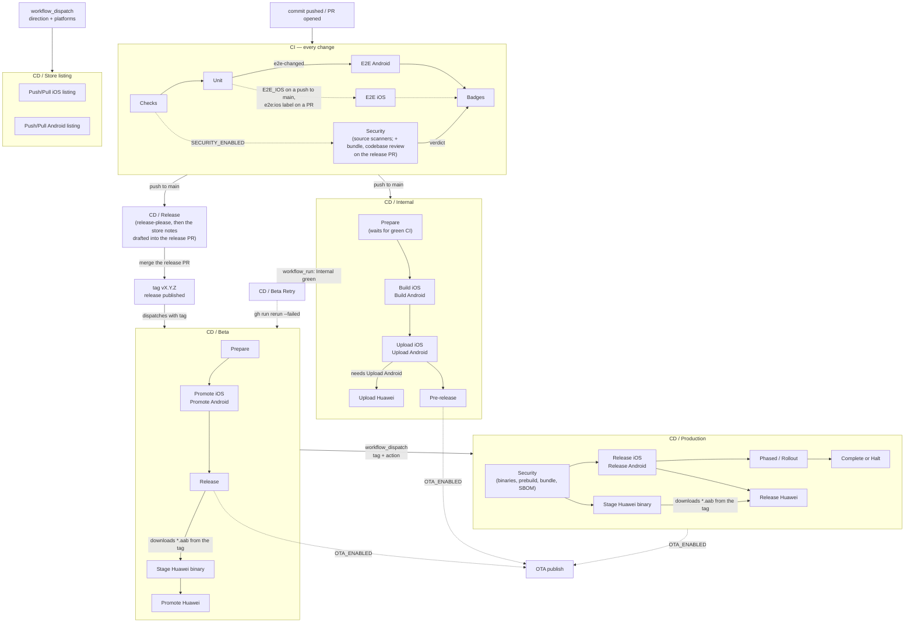

# CI

This repo runs almost no CI logic of its own. Nearly every job lives in
[`blinkbitcoin/shared-workflows`](https://github.com/blinkbitcoin/shared-workflows)
and the twelve files in `.github/workflows/` are thin callers that pick inputs.
Two of the twelve are the exception and are described below. The workflows repo's
`docs/consumer-guide.md` is the contract; this page is the template's half of
it.

## The callers

Twelve files, in two groups: five that run on every change, and seven that make
releases. The release group is documented in
[release-runbook.md](release-runbook.md) and [ota.md](ota.md); the table below
is the inventory.

The whole flow, with the **event** that crosses each boundary. Those labels are
the point: a GitHub run is created per event, not per file, so the Actions UI
can only ever show you one of these boxes at a time. That is also why these are
separate workflows rather than one — merging them would produce the same runs
with most jobs skipped.


```mermaid
flowchart TD
  commit["commit pushed / PR opened"] --> CI

  subgraph CI["CI — every change"]
    direction LR
    checks["Checks"] --> unit["Unit"] -->|"e2e-changed"| e2e["E2E Android"] --> badges["Badges"]
    unit -.->|"E2E_IOS on a push to main,<br/>e2e:ios label on a PR"| e2eios["E2E iOS"] -.-> badges
    checks -.->|"SECURITY_ENABLED"| sec["Security<br/>(source scanners; + bundle, codebase review<br/>on the release PR)"]
    sec -->|"verdict"| badges
  end

  CI -->|"push to main"| rp["CD / Release<br/>(release-please, then the store notes<br/>drafted into the release PR)"]
  CI -->|"push to main"| internal

  subgraph internal["CD / Internal"]
    direction LR
    prep["Prepare<br/>(waits for green CI)"] --> builds["Build iOS<br/>Build Android"]
    builds --> up["Upload iOS<br/>Upload Android"]
    up -->|"needs Upload Android"| uphuawei["Upload Huawei"]
    up --> pre["Pre-release"]
  end

  rp -->|"merge the release PR"| tag["tag vX.Y.Z<br/>release published"]
  tag -->|"dispatches with tag"| beta

  subgraph beta["CD / Beta"]
    direction LR
    bprep["Prepare"] --> promote["Promote iOS<br/>Promote Android"] --> brel["Release"]
    brel -->|"downloads *.aab from the tag"| bbin["Stage Huawei binary"]
    bbin --> bhuawei["Promote Huawei"]
  end

  internal -.->|"workflow_run: Internal green"| retry["CD / Beta Retry"]
  retry -.->|"gh run rerun --failed"| beta

  beta -->|"workflow_dispatch<br/>tag + action"| prod

  subgraph prod["CD / Production"]
    direction LR
    psec["Security<br/>(binaries, prebuild, bundle, SBOM)"] --> rel["Release iOS<br/>Release Android"] --> roll["Phased / Rollout"] --> done["Complete or Halt"]
    psec --> pbin["Stage Huawei binary"]
    pbin -->|"downloads *.aab from the tag"| phuawei["Release Huawei"]
    rel --> phuawei
  end

  listing["workflow_dispatch<br/>direction + platforms"] --> sm

  subgraph sm["CD / Store listing"]
    direction LR
    smios["Push/Pull iOS listing"]
    smandroid["Push/Pull Android listing"]
  end

  pre -.->|"OTA_ENABLED"| ota["OTA publish"]
  brel -.->|"OTA_ENABLED"| ota
  prod -.->|"OTA_ENABLED"| ota
```

Two edges are worth reading twice. `Prepare` in **CD / Internal** waits for CI
to conclude green for the same commit, so a red `main` never reaches a build or
a store. And `E2E` sits behind `Unit`, so a failed unit run never pays for a
twenty-minute Android suite or a macOS runner. `Unit` runs on every change;
`E2E` skips one it cannot affect, such as a unit-test or docs-only change (see
[Skipping a suite the change cannot affect](#skipping-a-suite-the-change-cannot-affect)).

Dotted edges are the configurable ones: a feature that exists, drawn where it
belongs, with the variable that turns it on. `Security` is on unless the
repository variable `SECURITY_ENABLED` is `false`, and `security-settings.json`
decides which scanners inside it run. On a pull request it runs the source
scanners (and the LLM review, once configured); on the release pull request it
adds the bundle scan and the codebase review (OpenAnt). On the production dispatch a second
`Security` job checks the release's own binaries, and every store job waits for
it. What each scanner reads, how to disable one, and what "skipped" means are in
[security.md](security.md).

The Huawei AppGallery jobs hang off the Google Play ones on purpose: each of
them `needs` its tier's Android store job, so AppGallery never receives a
bundle Play refused and is never the only store holding one. Internal uploads
the bundle this run just built. Beta and production have no bundle in the run
at all, so `Stage Huawei binary` downloads the `*.aab` back off the release tag
with `gh release download` and re-uploads it as an artifact the lane then
reads — AppGallery has no promote endpoint, so every tier is a fresh upload
with different submission flags. All five Huawei jobs are behind
`HUAWEI_UPLOADS_ENABLED` on top of `STORE_UPLOADS_ENABLED`.

**CD / Beta Retry** is not in the release chain; it is the repair for one
timing hole. A beta run refuses to promote until that commit's internal run is
green, and `release-please` dispatches beta exactly once, so a beta dispatched
while internal is still building (or red) fails at the gate with nothing left
to re-trigger it. `cd-beta-retry.yml` listens for `workflow_run` on a completed
**CD / Internal** for `main`, and when the conclusion is `success` it finds a
concluded-but-not-successful `cd-beta.yml` run for the same head commit
and does `gh run rerun --failed` on it — only the jobs that failed, so nothing
promotes twice. It matches on the internal run's head commit, so if another
commit lands on `main` in between, nothing matches and the retry no-ops.

**CD / Store listing** (`cd-store-listing.yml`) is a manual dispatch that is not part
of a release at all: two jobs, iOS and Android, both on the `production`
environment and therefore behind its reviewers, running `sync_metadata` (push)
or `pull_metadata` (pull) against `fastlane/metadata/**`. It uploads no binary,
moves no track and writes no version's store notes. It shares the `release`
concurrency group with the promoting workflows, so a listing edit and a store
submission are never open against the same app at once.

### Everyday CI

| File | Trigger | Calls | Notes |
| --- | --- | --- | --- |
| `ci.yml` | `push` to `main` (all paths), `pull_request` (`opened`, `synchronize`, `reopened`, `labeled`), `workflow_dispatch` | `check.yml`, `test-unit.yml`, `test-e2e.yml`, `check-security.yml`, `publish-badges.yml` | `unit`, `e2e` and `security` all `needs: checks`. `unit` runs on every change; `e2e` skips<br>when `checks` reports `e2e-changed` false, on a push as well as a PR<br>([Skipping a suite](#skipping-a-suite-the-change-cannot-affect)); `security` skips on `docs-only`<br>and when `SECURITY_ENABLED` is `false` ([security.md](security.md)); `badges` needs all three,<br>runs under `always()` and publishes this branch's badges (see [Badges](#badges)) |
| `ci-web.yml` | `pull_request`, `workflow_dispatch` (`deploy`) | `build-web.yml` | PR = production export + Playwright smoke, skipped by the called workflow's `Changes` job<br>when `web-changed` is false; a `deploy` dispatch from `cd-release.yml` at the tag = the same<br>export + Pages deploy (never skipped: a dispatch has no diff base, so the classifier fails open),<br>with `base-url` = `/<repo>` unless a custom domain is set, and `+not-found.html` copied to<br>`404.html` so a deep link boots the router |
| `ci-pr-closed.yml` | `pull_request: closed` | `pr-closed.yml` | cancels the closed PR's in-flight runs and drops its `gh-pages` badge directory; needs `actions: write` and `contents: write` |
| `ci-pr-title.yml` | `pull_request: edited` (only when the title changed) | `pr-title.yml` | `opened`/`synchronize` are already covered by `check.yml`'s `commits` |
| `ci-codeql.yml` | `push` to `main`, `pull_request` to `main`, `schedule` (Mon 06:17 UTC) | `check-code-scanning.yml` | CodeQL advanced setup. Informational — **never** a required check.<br>Config in `.github/codeql/codeql-config.yml`; `make check-code-scanning` runs the same queries locally |

`push` is deliberately scoped to `main` only: a PR branch in this repo would
otherwise fire both `push` and `pull_request` and run the whole suite twice for
the same commit.

`ci.yml` carries **no `paths-ignore`**, deliberately. It used to, back when the
reusable checks workflow derived its diff base from `github.event.pull_request.base.sha`
alone — empty on a push, so the classifier only ever classified PRs and every
merge to `main` ran the full matrix. `paths-ignore` was the workaround, and it
was a second docs rule sitting next to the classifier's: narrower (it missed
`LICENSE` and the issue/PR templates) and free to drift further. `check.yml`
now falls back to `github.event.before` on a push, so one rule answers both
events and the `changes` job is the single source. Widen what counts as docs
with the `docs-patterns` input, never with a second list here. Those alternatives
are joined into one ERE, so a stray leading, trailing or doubled `|` is
**refused outright** rather than appended: an empty alternative matches every
path, which would classify every change as docs-only and skip the whole matrix
green. A pattern that fails to compile for any other reason runs everything and
says so with a `::notice::`. `cd-internal.yml`
keeps a path filter of its own: that one is not a docs classification but a
"do not cut a build for this" rule, and it calls no classifier. It is a `paths`
list with negations rather than `paths-ignore`, because the last matching
pattern wins there: `*.prompt.md` ends in `.md` but is not documentation
(`store-notes.prompt.md` shapes the store notes the build ships), and only a
`paths` list can take it back. `scripts/release-workflows.test.mjs` evaluates
the filter the way GitHub does.

### Running CI locally

`make ci` runs everything CI runs except E2E, which needs a simulator or an
emulator. `make check` is the `check` workflow's half of that on its own.

Two gates are opt-in in CI and grouped locally as `make check-slow`:
`check-prebuild` and the bundle scan (`make check-security-bundle`), both minutes rather than
seconds. Enable the `prebuild` input on the `checks` call where the coverage
earns the wall clock; the bundle scan is `check-security.yml`'s `bundle` job,
which `ci.yml` already turns on for the release pull request.

That `make ci` and CI agree is enforced here, by this repo's own CI: the
`Checks / Contract` job runs shared-workflows' contract checker against this
repo at the workflows version `ci.yml` pins, and fails this repo's PR in either
direction. See
[quality.md](quality.md#make-check-is-the-ci-gate-set-and-that-is-enforced).

What that costs: only `e2e` and `security` skip on a docs-only change.
`check.yml`'s `code` job has no `docs-only` gate, so a documentation push to
`main` now runs the type check, lint, format, unused-code and spell gates and the audit — a couple of
minutes that used to be zero, because the workflow did not trigger at all.
That is the trade: those are exactly the checks a documentation change can
break. The expensive half, the native matrix, still skips.

### Skipping a suite the change cannot affect

The same `changes` job also classifies the diff per suite, and a suite's gate
reads its own class rather than `docs-only`:

| Output | Gates | `false` when every changed file is docs or one of |
| --- | --- | --- |
| `e2e-changed` | `e2e` | `__tests__/`, `__snapshots__/`, `*.test.*`, `jest.config.*`, `e2e/web/`, `playwright.config.*`, `fastlane/` |
| `web-changed` | `ci-web.yml`'s Build, E2E and Deploy | `.maestro/`, `__snapshots__/`, `jest.config.*`, `fastlane/`, `Gemfile`, `Gemfile.lock` |

The lists are shared-workflows' (its `docs/consumer-guide.md`, "The suite
classes"), and each is an *ignore* list: a path on none of them, a new directory
included, runs the suite. Nothing under `.github/` is on any of them, so a
change to a caller workflow or a Dependabot pin bump runs everything.

**`unit` has no gate.** The classifier also writes `unit-changed`, and
`ci.yml` does not read it: there is no change the unit suite cannot affect
here. `Unit` is not only Jest. It runs `test:scripts`, whose repository-wide
guards read every tracked file, documentation included:
`scripts/ports.test.mjs` rejects a bare port literal anywhere. The classifier's
unit list ignores `.maestro/`, `e2e/`, `playwright.config.*`, `fastlane/`, the
Gemfile and docs, so gating on it let a change to those alone land without the
guards, to fail whichever PR ran `Unit` next. The cost is the minute or two
`Unit` takes on a docs-only change.

Every gate is `!= 'false'`, never `== 'true'`: an output that never arrived,
or a diff the classifier could not read, runs the suite. Three consequences
follow:

- **E2E gates the way the consumer guide shows.** Under `!cancelled()` it
  needs a green `checks`, a `unit` result of `success` *or* `skipped`, and
  `e2e-changed`: a failed unit run still keeps E2E from starting, and a
  skipped one would not, should `unit` ever be gated again.
- **The web export gates itself.** `build-web.yml` runs the same classifier in
  its own `Changes` job, so `ci-web.yml` carries no `if:`. The tag's deploy is
  a `workflow_dispatch`, which has no diff base, so it always builds.
  `scripts/ci-web-gate.test.mjs` holds both.
- **The badges keep the last real answer.** When `E2E` skips, only `Unit`'s
  badges are republished, and a run where both skipped (a red `checks`)
  publishes nothing (see [Badges](#badges)).

`scripts/ci-suite-gates.test.mjs` evaluates the `unit`, `e2e` and `badges` jobs
together as a graph, for each kind of change and for failed, cancelled and
unclassified runs, and holds `unit` to having no gate. The shared contract check (`make check-contract`, CI's
Checks / Contract) checks that every output `ci.yml` reads is one `check.yml` declares at the pin. A renamed output would read as
empty and quietly run every suite.

### Release and OTA

| File | Trigger | Calls | Notes |
| --- | --- | --- | --- |
| `cd-release.yml` | `push` to `main` (all paths), `workflow_dispatch` | `googleapis/release-please-action@v5`, `pr-store-notes.yml` | Keeps one release PR open, dispatches `ci.yml` on its branch and drafts the<br>`## Store notes` section into its body (the only job that may call an LLM).<br>On a cut release, dispatches `cd-beta.yml` and `ci-web.yml` at the tag |
| `cd-internal.yml` | `push` to `main` (skipping `docs/**`, `**.md`), `workflow_dispatch` | `build-prepare.yml`, `build-ios.yml`, `build-android.yml`,<br>`publish-store.yml`, `publish-github-release.yml`, `publish-ota.yml` | The only workflow that builds binaries |
| `cd-beta.yml` | `workflow_dispatch` (`tag`), from `cd-release.yml` or by hand | `build-prepare.yml`, `publish-store.yml`, `publish-github-release.yml`, `publish-ota.yml` | Promotes the binary internal already built and tested. Never builds |
| `cd-production.yml` | `workflow_dispatch` (`tag`, `action`) | `build-prepare.yml`, `check-security.yml`, `publish-store.yml`, `publish-github-release.yml`, `publish-ota.yml`, `build-web.yml` | `action` selects release, rollout, halt, resume or complete;<br>on `release` the store jobs wait for `security`, and `web` redeploys Pages<br>with the same `base-url` as `ci-web.yml` |
| `cd-beta-retry.yml` | `workflow_run` on a completed `CD / Internal` (its display name) for `main` | nothing: it re-runs a failed beta run with `gh` | Closes the hole where the beta dispatch arrives once, before internal is green |
| `cd-ota-hotfix.yml` | `workflow_dispatch` (`channel`, `ref`, rollout) | `publish-ota.yml` | JavaScript-only fixes. The fingerprint gate rejects anything native |
| `cd-store-listing.yml` | `workflow_dispatch` (`direction`, `platforms`, `dry_run`) | `publish-store.yml` (twice: iOS and Android) | The store *page*, not a release: `sync_metadata` pushes `fastlane/metadata/**`<br>to App Store Connect and Play, `pull_metadata` reports what they hold. Both<br>jobs run on the `production` environment, behind its reviewers, and are gated<br>on `STORE_METADATA_SYNC_ENABLED` |

On a repo that never turns OTA on, the store path still works: only the `ota-*`
jobs are skipped, through `if: vars.OTA_ENABLED == 'true'`, and `cd-ota-hotfix.yml`
skips both of its jobs. See [ota.md](ota.md).

## How CI maps to `make`

Everything CI runs has a local equivalent. The reusable workflows call
`package.json` scripts by name (the "script contract"), which is exactly what
the `make` targets wrap — so a green `make check && make test-unit && make test-e2e-ios`
locally means the same commands passed the same way in CI.

| CI job | Scripts it runs | Local equivalent |
| --- | --- | --- |
| `check.yml` | `check:types`, `check:lint`, `check:format`, `check:unused`, `check:spell`, `check:generated`,<br>`check:expo-health`, `check:audit`, `check:licenses`, commitlint, `check:ci`, `check:docs`, `check:release`,<br>`check:secrets`. `check:ci` also runs the shell-locale, workflow-name and ignored-directories guards,<br>`check:docs` the make-target-name guard (all from `@blinkbitcoin/app-tooling`) | `make check-code`, `make check-generated`, `make check-expo-health`, `make check-audit`,<br>`make check-licenses`, `make check-ci`, `make check-docs`, `make check-release`,<br>`make check-secrets` (`make check` runs all of it) |
| `test-unit.yml` | `test:coverage`, `test:scripts` | `make test-coverage`, `make test-scripts` (`make test-unit` runs `test` + `test:scripts`);<br>both gate coverage at 100%; `test:scripts` includes the `make setup` suite |
| `test-e2e.yml` | Maestro flows in `.maestro/` against a debug build | `make test-e2e-ios` / `make test-e2e-android` (after `make dev-api`, `make dev`, `make dev-ios`/`make dev-android`) |
| `build-web.yml` | `build:web`, `test:e2e:web` | `make build-web`, `make test-e2e-web` |
| `check-code-scanning.yml` | no consumer script: the CodeQL action reads `.github/codeql/codeql-config.yml` | `make check-code-scanning` (same config, same suite, same packs) |

Two script-contract details are load-bearing:

- Every script is named for the gate, never the tool: `check:unused` runs
  `knip`. A script literally named `knip` would fail `expo-doctor`'s
  "Check package.json for common issues" ("scripts in package.json conflict
  with the contents of node_modules/.bin"), which `check:expo-health` runs.
  The workflows' `run-script.sh` runs `pnpm run NAME` when the script exists
  and `pnpm exec NAME` when only `node_modules/.bin/NAME` does.
- `test:e2e:web` is `bash scripts/e2e/web.sh`, which skips its own export when
  `PLAYWRIGHT_SKIP_EXPORT` is set. `build-web.yml` exports once in its `build` job,
  uploads the result as the `web-dist` artifact, and sets that variable for the
  Playwright job — the point being that Playwright tests the exact bytes that
  would deploy, not a second, possibly-different export. Those bytes carry
  `.env.production`'s API URL on a deploy run, so `e2e/web/fixtures.ts`
  redirects the page's GraphQL calls to the mock API rather than rebuilding.

## E2E: iOS runs on main, and on a PR only when asked

macOS GitHub-hosted runners bill at 10x **on a private repo**, which is why
`test-e2e.yml`'s `ios` input defaults to `false` — the safe default for the app
repos generated from this template. **On a public repo standard runners are
free, macOS included**, so this repo sets `E2E_IOS=true`. There is no cost
argument for skipping it here.

What is still true either way is wall-clock: iOS takes roughly three times as
long as Android. So even here a PR does not run it by default; every push to
`main` does. `ci.yml` passes:

```yaml
ios: ${{ (github.event_name != 'pull_request' && vars.E2E_IOS == 'true') || contains(github.event.pull_request.labels.*.name, 'e2e:ios') }}
```

Two independent ways in:

- **Repo variable** — set `E2E_IOS=true` (Settings → Secrets and variables →
  Actions → Variables) to run iOS on every push to `main` and every manual run
  of CI. It does not reach PRs.
- **PR label** — add the `e2e:ios` label to a single PR to run iOS on it, with
  or without the variable. The `labeled` trigger in `ci.yml` is what makes
  adding the label start a fresh run; a label change is not a `synchronize`
  event, so without it the label would only take effect on the next push. The
  label stays on the PR, so later pushes run iOS too. A new repo has no such
  label; create it once with
  `gh label create e2e:ios --description "Run the iOS E2E suite on this PR"`.

`scripts/ci-e2e-ios.test.mjs` evaluates that expression for each of those
events, so a change to it that lets iOS back onto every PR fails `make
test-scripts`.

Android runs on every run whose change can affect E2E (`android` defaults to `true`).

`macos-runner` is passed as `${{ vars.WORKFLOWS_MACOS_RUNNER || 'macos-26' }}`:
set the repo variable `WORKFLOWS_MACOS_RUNNER` to move iOS onto a different (e.g.
self-hosted) macOS label without editing the workflow. `WORKFLOWS_MACOS_RUNNER` is a
convention documented by the workflows repo, not a default any workflow applies
on its own — hence the explicit `||` fallback.

## The dev-client launch mechanism

`ci.yml` passes `dev-client: true`, so the E2E jobs start Metro with
`--dev-client` and foreground the app through the
`expo-development-client` deep link rather than a plain launch:

```
rnmt://expo-development-client/?url=http%3A%2F%2Flocalhost%3A$METRO_PORT  # iOS
rnmt://expo-development-client/?url=http%3A%2F%2F10.0.2.2%3A$METRO_PORT   # Android (10.0.2.2 is the host from the emulator)
```

`METRO_PORT` is `APP_PORT_BASE` + 1 (`scripts/ports.mjs`). Its default is also
the workflows repo's `WORKFLOWS_METRO_PORT` default, so CI and a default local run
reach the app on the same port.

This matters because `expo-dev-client`'s launcher screen finds Metro over
Bonjour, which does not work on a simulator or emulator (and certainly not on a
CI runner). Landing on that screen means the suite waits forever for a
"DEVELOPMENT SERVERS" entry that never appears.

Consequences encoded in this repo:

- `.maestro/flows/00-launch.yaml` uses `launchApp: stopApp: false` with **no**
  `clearState`. Restarting or clearing state would throw away the deep-linked
  session and drop the dev client back on its launcher. The launcher taps are
  still in the flow, but every one of them is `optional: true` — a fallback,
  never the happy path.
- `scripts/e2e/maestro-ios.sh` and `scripts/e2e/maestro-android.sh` open the
  same deep link before invoking Maestro, mirroring the workflows repo's
  `scripts/e2e/app-launch.sh`, so a local run and a CI run reach the app the
  same way.

## Mock-API hooks

The flows talk to the local GraphQL mock API (`pnpm dev:api`, on
`APP_PORT_BASE` + 2). `ci.yml` wires the workflows' generic E2E hooks to two
small scripts in this repo:

```yaml
e2e-setup-script: scripts/e2e/ci-mock-api-up.sh
e2e-teardown-script: scripts/e2e/ci-mock-api-down.sh
```

- **Setup** starts `pnpm dev:api` with `nohup`, writes its pid to
  `$WORKFLOWS_OUT/mock-api.pid` (falling back to `/tmp` outside CI), and blocks on
  `scripts/e2e/wait-for-mock-api.sh` until the server answers a real GraphQL
  query. A missing setup script is fatal — the job fails before the suite runs.
- **Teardown** kills that pid if it is still alive and always exits `0`. It runs
  with `if: always()`, so it must never turn a diagnosable failure into a
  confusing one.

Setup also runs `adb reverse` for the derived mock-API port when a device is
attached. The workflows repo reverses `WORKFLOWS_MOCK_API_PORT`, whose default still
predates `APP_PORT_BASE`; until it derives its ports from the same base, the
hook covers the gap.

The paths are consumer-relative file paths run with `bash`, not `package.json`
script names. The workflows repo's own `self-smoke.yml` points at these exact
paths, so renaming them breaks that smoke test.

## Forensics

A failed run uploads its evidence as named artifacts — download these from the
run's summary page first:

| Artifact | From | Contents |
| --- | --- | --- |
| `forensics-ios` | `test-e2e.yml`'s `ios` job | Maestro's `--debug-output` tree (per-flow `commands-*.json`, failure screenshots, `maestro.log`),<br>the simulator screen recording, Metro's log, the device system log,<br>and any crash report from `DiagnosticReports` newer than the run's start stamp<br>(older ones are filtered out so a previous job's crash on the same runner cannot be misread as this one's) |
| `forensics-android` | `test-e2e.yml`'s `android` job | The same Maestro debug tree, the emulator screen recording, Metro's log and `logcat` |
| `playwright-report` | `build-web.yml`'s `e2e` job | The Playwright HTML report (traces, screenshots) |
| `coverage` | `test-unit.yml` | `coverage/`, uploaded on every run (30-day retention) |

The two E2E jobs also pass their builds between jobs as `ios-app` and
`android-apk`; those are plumbing, not forensics.

Locally the same debug tree lands in `.maestro/output/` (gitignored).

## Badges

The README's four badges are real, per-branch and measured. `ci.yml`'s
`badges` job renders them from the run's own results and publishes them to the
`gh-pages` branch:

```
gh-pages
└── badges/
    ├── main/{unit,e2e,coverage,security}.svg (+ .json)
    └── <branch>/…
```

| Badge | Source |
| --- | --- |
| `unit.svg` | the `unit` job's result (`success` → passing, `failure` → failing; `cancelled` and `skipped` publish nothing) |
| `e2e.svg` | the `e2e` job's result, same map |
| `coverage.svg` | `coverage/coverage-summary.json` from the `coverage` artifact — Jest's `json-summary` reporter, never scraped HTML |
| `security.svg` | `check-security.yml`'s `verdict` output — the verdict's own word from `.security/verdict.json`,<br>never the job's result (see below) |

Rendering and publishing are both the workflows repo's: `publish-badges.yml`
draws the badges with the shared tooling package's `gen-badges`, from its own
checkout, and publishes them with `scripts/ci/publish-badges.sh`. This
repository ships no renderer of its own (`badges-script` stays empty);
`make gen-badges` runs the same `gen-badges` from `@blinkbitcoin/app-tooling`
to preview them locally.

These details are deliberate:

- **The job runs under `always()`** so a red Unit still gets a red badge — but
  it skips when an upstream job was *cancelled*, when both suites skipped
  (a red `checks`), on release events, and on PRs from forks (which have no
  write token). A docs-only change runs `Unit`, so it publishes: `ci.yml`
  deliberately passes no `docs-only`, which `publish-badges.yml` would skip on.
- **A skipped suite keeps its published badge.** When `Unit` ran and `E2E`
  skipped, `publish-badges.sh` republishes only `Unit`'s. A grey `skipped`
  would overwrite the branch's last real answer with "this run did not look".
- **Only a Unit *failure* writes the red coverage placeholder.** A *skipped*
  Unit renders no coverage badge at all, so a red `checks` leaves the branch's
  published coverage badge exactly as it was instead of blanking it.
- **Closing a PR removes `badges/<branch>/`** (`pr-closed.yml`), which is why
  that caller grants `contents: write`.
- **A `checks` failure leaves the badges as they were.** `unit` and `e2e` both
  `needs: checks`, so a red lint run makes them *skip*, and a run where both
  skipped publishes nothing. The README goes on showing the last suites that
  ran. The red run is visible where CI is: the PR's checks and the Actions tab.

**The Security badge shows the verdict, not the job.** The `security` job
succeeds on `pass`, `informational` and `skipped` alike, so its result cannot
tell them apart; `ci.yml` hands `publish-badges.yml` the `verdict` output
instead (see [security.md](security.md#where-the-verdict-goes)):

| Verdict | Badge |
| --- | --- |
| `pass` | green `passing` |
| `informational` | `<highest> findings`: yellow for low or medium, orange for high or critical |
| `skipped` | grey `skipped` |
| `fail` (findings block, a scanner crashed, or the Security run broke before its verdict) | red `failing` |
| `disabled` (`SECURITY_ENABLED=false`, or `"enabled": false` in `security-settings.json`) | grey `disabled` |
| nothing could block (`severity` is `none` or `failOn` is empty) | the message above plus `(advisory)` |

- **A skipped Security keeps its published badge.** A docs-only change skips
  the `security` job, hands over no verdict, and `gen-badges` writes no
  `security.svg`, so the branch's last real answer stays.
- **Security switched off shows `disabled`.** A stale green badge for a gate
  that no longer runs would be the one wrong answer.
- **A cancelled Security publishes nothing,** like a cancelled suite.

**Coexistence with the web target.** `ci-web.yml` deploys the web export to GitHub
Pages through `actions/deploy-pages`, which is an *artifact* deploy and does not
read any branch. The badges live on a `gh-pages` branch and are served from
`raw.githubusercontent.com`, not from the Pages site, so the two do not collide
— **as long as the repo's Pages source stays "GitHub Actions"**. Switching it to
"Deploy from a branch → gh-pages" would make every web deploy fight the badge
commits and publish the badge directory as the site. Two repo settings go with
this: keep that Pages source, and exempt `gh-pages` from the PR-approval ruleset
so the default `GITHUB_TOKEN` can push to it.

## Pinning and bumping the workflows version

Every `uses:` that points at the workflows repo is pinned to one commit SHA,
with that release's version beside it. Eleven of the twelve files carry at least
one, and several carry many: `cd-production.yml` alone has twelve.
`cd-beta-retry.yml` calls no reusable workflow at all.

```yaml
uses: blinkbitcoin/shared-workflows/.github/workflows/check.yml@cac53495f533066ce02fb64ef894d178c3e1286b # v0.20.0
```

A shared-workflows release changes nothing here by itself
([ADR 0023](decisions/0023-cd-verified-before-release.md)). Dependabot's
`shared-workflows` group (`.github/dependabot.yml`) opens one PR moving every
pin, release workflows included, and that PR's Unit job runs the new shared
code against this repository before any CD run can:

- The shared contract check (`check-contract` from `@blinkbitcoin/app-tooling`,
  CI's Checks / Contract) checks every call's inputs, their types and secrets,
  and every output a caller reads, against what the called workflow declares
  at the new commit, and that every pin and the tooling package are on that
  one commit.
- `scripts/release/store-notes.test.mjs` runs the store-notes chain through the
  shared scripts and our generator, end to end.

The same Unit job fails until one more thing moves. The shared tooling package
(`@blinkbitcoin/app-tooling`, behind `make check-contract`) is a git dependency
on shared-workflows at the pinned commit
([ADR 0024](decisions/0024-shared-tooling-at-the-workflows-pin.md)), and
Dependabot cannot move a git dependency with the pins. Check out the PR's
branch, run `make fix-tooling-pin` (it repoints `package.json` at the new pin
and relocks), and push.

Then read the release's notes and merge. To bump by hand, change every `uses:`
in one pass to the new release's commit and version, then run
`make fix-tooling-pin`; the contract check fails on two different pins or a
tooling package left behind, and zizmor fails on anything but a hash pin for
shared-workflows (`.github/zizmor.yml`). All callers share the `.workflows/` self-checkout
and the script contract, and mixing versions across them is untested.

## `.workflows/`

Every job checks the workflows repo out into `$GITHUB_WORKSPACE/.workflows` and
reaches its scripts through `$WORKFLOWS_DIR`. Nothing in this repo references
`shared-workflows` paths directly. Local tooling that walks the whole tree
ignores it, in every place the consumer guide's
[`.workflows/` ignore list](https://github.com/blinkbitcoin/shared-workflows/blob/main/docs/consumer-guide.md#workflows-ignore-list-for-consumers)
names: `biome.json` (`!**/.workflows`), `eslint.config.mjs` (`.workflows/**`),
`tsconfig.json` (`exclude`), `knip.json` (every glob is rooted, so none reaches
it), `typos.toml` (`extend-exclude`), `jest.config.ts`
(`testPathIgnorePatterns` and `modulePathIgnorePatterns`, anchored to
`<rootDir>`), `metro.config.js` (`resolver.blockList`), `.semgrepignore`,
the CodeQL configuration and `.gitignore` (`/.workflows`).
`check-ignored-directories` (from `@blinkbitcoin/app-tooling`, run by
`make check-ci`) asks each of those tools whether it still skips the
directory, and the contract check reports any of them this repository loses.
