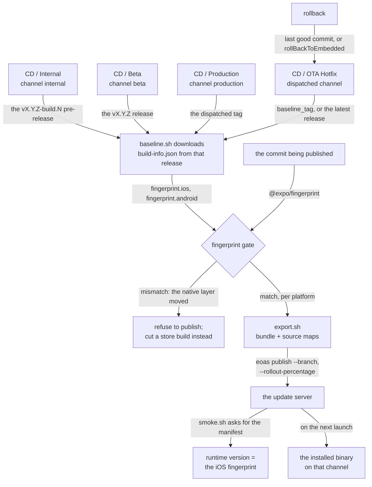

# Over-the-air updates

OTA ships a JavaScript-only change to already-installed apps without a store
review. It is **off by default** in this template, and turning it on is a
deliberate act: an update reaches every installed app on the channel within one
launch and cannot be recalled once downloaded.

Related: [release-runbook.md](release-runbook.md) (the store path),
[../certs/README.md](../certs/README.md) (code-signing keys),
[../deploy/ota/README.md](../deploy/ota/README.md) (the server).

## The flow

Every publish — the three release tiers and a hotfix — is the same pipeline
with a different channel and a different fingerprint baseline:



The gate runs **before** the export, so an update that cannot be served never
gets built. The rest of this page is the detail behind each box: the channel
per tier under [The channel model](#the-channel-model), the comparison itself
under [The fingerprint gate](#the-fingerprint-gate), and the two dispatched
paths under [Hotfix](#hotfix) and [Rollback](#rollback).

## The toggle

One variable, read in three places:

| Place | Effect when `OTA_ENABLED` is not `true` |
| --- | --- |
| `app.config.ts` | `updates: { enabled: false }` — no URL, no certificate, no update check is compiled into the binary |
| `.github/workflows/release-{internal,beta,production}.yml` | the `ota-*` job is skipped (`if: vars.OTA_ENABLED == 'true'`) |
| `.github/workflows/cd-ota-hotfix.yml` | the publish job is skipped |

The build-time value comes from the `OTA_ENABLED` environment variable. A GitHub
repository *variable* is never automatically an environment variable, so the
release callers forward it (and `EXPO_UPDATES_URL`) explicitly through the
`build-env` input on `build-prepare.yml` / `build-ios.yml` /
`build-android.yml`:

```yaml
      build-env: >-
        {"APP_VARIANT":"production",
        "OTA_ENABLED":"${{ vars.OTA_ENABLED }}",
        "EXPO_UPDATES_URL":"${{ vars.EXPO_UPDATES_URL }}", ...}
```

Without that forwarding the binary would compile with `updates: { enabled: false }`
and no URL while the OTA jobs published happily — a completely silent failure in
which no installed app ever receives an update. Both names are non-secret, which
is what makes `build-env` the right channel; it refuses anything that reads as a
credential.

The reusable `publish-ota.yml` has its own `ota-enabled` master switch too,
so the caller also passes `ota-enabled: ${{ vars.OTA_ENABLED == 'true' }}` and
the job is skipped twice over — belt and braces on the one setting that cannot
be undone.

Leaving it off is a supported end state. The rest of the release path works
unchanged; there is simply no OTA job.

## Enabling it: three steps

### 1. Generate your own code-signing key pair

**The certificate committed at `certs/expo-updates-cert.pem` is a placeholder.**
It exists so that an `OTA_ENABLED=true` prebuild works out of the box; its
private key was generated and immediately discarded, so it can never sign
anything. Replace it before you publish a single update.

```bash
npx expo-updates codesigning:generate \
  --key-output-directory ./keys \
  --certificate-output-directory ./certs \
  --certificate-validity-duration-years 10 \
  --certificate-common-name "Your App"
mv certs/certificate.pem certs/expo-updates-cert.pem
```

Commit **only** `certs/expo-updates-cert.pem`. Put `keys/private-key.pem` in the
server's secret store (`EOO_PRIVATE_KEY`) and delete the local copy. `keys/` is
gitignored. `updates.codeSigningMetadata` in `app.config.ts` (`keyid: 'main'`,
`alg: 'rsa-v1_5-sha256'`) must match how the key signs; the command above
produces exactly those. Full details in [`certs/README.md`](../certs/README.md).

Rolling the pair later requires a new store build: a client only trusts the
certificate baked into the binary it is running.

### 2. Deploy the update server

[`deploy/ota/`](../deploy/ota/README.md) has a Docker Compose deployment, an
`.env.example` and the reverse-proxy, storage and backup notes. The image
reference and `EOO_*` variable names in it are **unverified offline** and must be
checked against the upstream README on first deploy.

### 3. Set the variables and secrets

| Name | Kind | Value |
| --- | --- | --- |
| `OTA_ENABLED` | repo variable | `true` |
| `EXPO_UPDATES_URL` | repo variable | the server's public origin, byte-identical to the server's `EOO_BASE_URL` |
| `OTA_CLI_VERSION` | repo variable | exact `eoas` version, e.g. `1.4.0`. `scripts/ota/publish.sh` in the workflows repo **refuses to run unpinned** |
| `OTA_PUBLISH_TOKEN` | secret (per environment) | one of the server's `EOO_TOKENS` |

Scope `OTA_PUBLISH_TOKEN` per GitHub Environment (`internal`, `beta`,
`production`) so a leaked internal token cannot publish to production. The
callers pass `environment:` to `publish-ota.yml` for exactly that reason.

`EXPO_UPDATES_URL` does double duty: besides being compiled into the binary,
every caller passes it as `manifest-url` so that after each publish
the workflow fetches the manifest a client would fetch, with the same `expo-*`
headers, and fails when it does not come back. A publish that "succeeded" but
serves nothing is otherwise indistinguishable from a working one until a user
opens the app. The check defaults to the iOS platform, so the callers pair it
with `runtime-version: ${{ needs.prepare.outputs.fp-ios }}`. `cd-ota-hotfix.yml`
has no prepare job, but it does resolve a baseline release — and that release's
`build-info.json` carries the `fingerprint.ios` of the binary currently
installed on the channel, which is exactly the runtime version to ask for. Its
`baseline` job downloads it and passes it on, so a hotfix (the publish most
likely to be made under pressure) is checked like every other. When the baseline
carries no fingerprint, the smoke check is skipped rather than failing a good
publish on a missing header.

`cd-ota-hotfix.yml`'s `baseline` job carries the same `vars.OTA_ENABLED == 'true'`
condition as its `publish` job: on a repo with OTA off a dispatch would
otherwise burn a runner and fail with "no baseline release found", which reads
as a hotfix problem rather than "OTA is not enabled here".

Then rebuild and ship a store build. An OTA update can only reach a binary that
was compiled with `OTA_ENABLED=true` and the right certificate — turning the
variable on does not retrofit apps already in the field.

## The channel model

There is **one binary**, promoted internal → beta → production, so the binary
bakes `expo-channel-name: production` (`app.config.ts`, `updates.requestHeaders`).
Internal and beta testers are running that same binary; they reach the other
channels at runtime rather than through a different build:

```ts
// src/services/updates.ts
updates.switchChannel('beta');  // setUpdateRequestHeadersOverride, then check
```

That is wired to the hidden developer menu and is dev/QA only. The override is
per-install and does not survive a reinstall.

`runtimeVersion` is `{ policy: 'fingerprint' }`: the runtime version *is* the
native fingerprint, so a binary can only ever be offered updates built from a
matching native layer.

## The fingerprint gate

Every publish runs `scripts/ota/fingerprint-gate.sh` (in the workflows repo)
**before** the export. It computes this commit's iOS and Android fingerprints
with the template's own `@expo/fingerprint` devDependency and compares them,
per platform, against `fingerprint.ios` / `fingerprint.android` in the baseline
release's `build-info.json`. Any mismatch is fatal. A `build-info.json` with no
`fingerprint` block is a failure, not a pass.

This is the most important guard in the release path. An update whose JS expects
a native module the installed binary does not have does not fail politely — it
crashes on launch, for every user on the channel, and the only fix is a new
store build that has to clear review.

**The baseline is a release tag, never a same-run artifact.**
`scripts/ota/baseline.sh` does `gh release download "$TAG" --pattern build-info.json`.
`actions/download-artifact` can only see artifacts from the run it executes in,
so a same-run artifact would compare the commit against itself and the gate
would pass unconditionally. What each caller points `baseline-tag` at:

| Caller | Channel | `baseline-tag` |
| --- | --- | --- |
| `cd-internal.yml` | `internal` | the `vX.Y.Z-build.N` pre-release this run just created |
| `cd-beta.yml` | `beta` | the `vX.Y.Z` release being promoted |
| `cd-production.yml` | `production` | the dispatched `tag` |
| `cd-ota-hotfix.yml` | dispatched | the `baseline_tag` input, or the latest non-prerelease when empty |

A missing tag, a missing release or a release with no `build-info.json` asset is
fatal, by design.

## Hotfix

A JS-only fix on a channel that already has a store build:

1. Land the fix (or a cherry-pick branch). **If it touches native code, plugins,
   or adds a dependency with a native module, it is not a hotfix** — the gate
   will reject it, and correctly so. Cut a new version instead.
2. Run **Actions → CD / OTA Hotfix** with `channel`, `ref` and a `rollout` (default
   `10`). `baseline_tag` can stay empty; it resolves to the latest release.
3. Production requires the `production` environment's reviewer, the same as a
   store release.
4. Watch, then re-run at a higher `rollout` to ramp. The rollout percentage is
   the only brake there is — a downloaded update is already on the device.

## Rollback

There is no "unpublish". Rolling back means publishing something newer that
supersedes the bad update:

| Situation | Action |
| --- | --- |
| Bad update, good previous JS | Publish the previous commit to the same channel at 100% (`cd-ota-hotfix` with `ref` = the last good sha) |
| Bad update, want the store binary's own bundle back | `rollBackToEmbedded` directive on the channel, or `eoas rollback` — both leave the installed binary running its baked-in JS |
| Bad **native** build | OTA cannot help. Halt the store rollout (`cd-production.yml` with `action: halt`) and ship a new build |

Rolling back is a publish like any other: it passes the same fingerprint gate,
and the client only picks it up on its next launch.

## Unverified: the `eoas` CLI flags

`scripts/ota/publish.sh` (workflows repo) calls:

```
npx eoas@$OTA_CLI_VERSION publish --branch CHANNEL --rollout-percentage N --non-interactive
```

Those three flags come from the OTA runbook and **could not be checked against
the CLI offline**. Confirm them with `npx eoas@<pinned version> publish --help`
the first time `OTA_CLI_VERSION` is pinned, and fix the script and this note
together. `OTA_PUBLISH_TOKEN` is on the same list: the workflow puts it in the
publish step's environment, but the script never names it, so whether `eoas`
reads that exact variable is unverified. A wrong name surfaces as an auth error,
not as a flag error.

## Fallback: the reference server

If the self-hosted server does not work out, the fallback is Expo's hosted
update service (EAS Update). It changes `EXPO_UPDATES_URL` and the publish CLI
(`eas update` rather than `eoas`), so `scripts/ota/publish.sh` and
`scripts/ota/export.sh` in the workflows repo would need a second implementation
behind the same interface. Everything else — the toggle, the channel model, the
fingerprint gate, the baseline-tag contract, the callers in this repo — is
unchanged, because none of it knows which server it is talking to.
