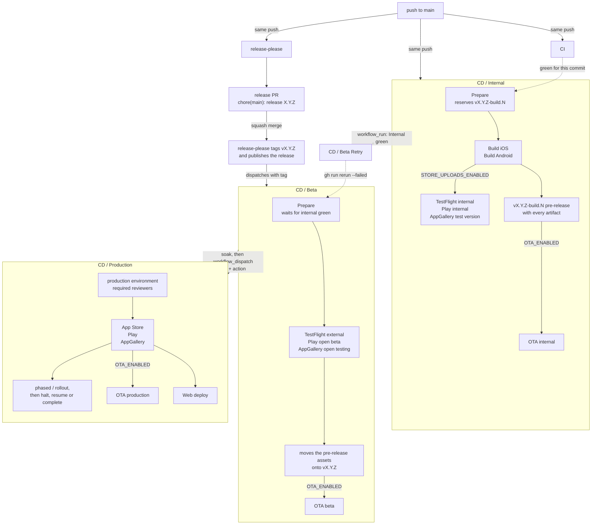
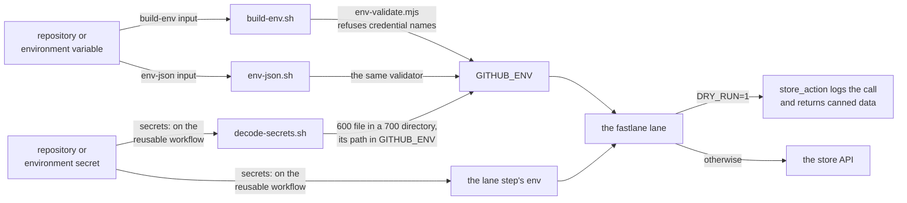

# Release runbook

Everything between "a PR is merged" and "users have it". The mechanics live in
[`blinkbitcoin/shared-workflows`](https://github.com/blinkbitcoin/shared-workflows);
this repository only ships policy — which workflow runs when, with which inputs.

OTA is documented separately in [ota.md](ota.md).

## The shape of it

```
merge a PR ──► CD / Internal      TestFlight internal + Play internal
                    │              vX.Y.Z-build.N pre-release, OTA internal
                    ▼
merge the release PR ──► release-please ──► vX.Y.Z release published,
                                                  │  CD / Beta + CI / Web dispatched
                                                  ▼
                                            CD / Beta      TestFlight external
                                                  │        + Play open beta
                                            (soak)│        + OTA beta
                                                  ▼
                                     CD / Production (dispatch, reviewed)
                                            App Store + Play + web + OTA
```

One binary is built once, on the merge to main, and then *promoted*. Beta and
production never rebuild — they call store APIs against the build that internal
already produced and that testers already used. That is why
`cd-beta.yml` will not promote until that exact commit's `cd-internal`
run is green (`require-green-workflow: cd-internal.yml`).

## The six steps

The whole chain, with what triggers each hop and what each stage produces. Two
workflows run off the same push to `main` — `cd-internal` builds, and
`release-please` maintains the release PR — and everything after the tag is a
dispatch, because a workflow cannot trigger a workflow through its own
`GITHUB_TOKEN` (see [Why the hop is a dispatch](#why-the-hop-is-a-dispatch)).



The dotted edges are the two gates and the one repair. `Prepare` in **CD /
Internal** blocks until CI concludes green for the same commit; `Prepare` in
**CD / Beta** blocks until that commit's internal run is green, dispatching one
itself if none exists; and **CD / Beta Retry** re-runs a beta run that failed
that second gate, the moment internal for the same commit turns green.

### 1. Merge PRs to main

`cd-internal.yml` runs on every push: it resolves the version and build
number, builds and signs both platforms, uploads to TestFlight internal and the
Play internal track, creates a `vX.Y.Z-build.N` GitHub pre-release with every
artifact, and (if OTA is on) publishes to the `internal` channel. When Huawei
AppGallery is turned on, the same bundle also goes there as a test version with
manual review skipped — automated review, hours rather than days, up to 100
testers (see [Huawei AppGallery](#huawei-appgallery)).

Smoke the build on TestFlight internal / Play internal. Nothing further is
automatic.

### 2. Merge the open release PR

release-please keeps one `chore(main): release X.Y.Z` PR open, with the
generated `CHANGELOG.md` section. **Merging it is the only human action that
cuts a release**: it bumps `package.json`, tags `vX.Y.Z` and publishes the
GitHub release.

**Squash-merge it** (rebase also works). The release commit's subject is one of
the sources `resolve-version.sh` reads to stamp the build that ships with this
release — see [Versions and build numbers](#versions-and-build-numbers) — and a
squash or rebase merge carries the PR title, `chore(main): release X.Y.Z`, onto
main. A "Create a merge commit" merge writes `Merge pull request #N from …`
instead; the script recovers by reading the merge's second parent, but squash is
the setting that keeps this simple. Settings → General → Pull Requests: allow
squash merging and make it the default.

The release PR's own checks look odd and that is expected: a bot-authored PR's
`pull_request` runs wait for a human to approve them and are marked failed when
the PR merges. release-please dispatches `ci.yml` on the PR's branch instead
every time it creates or updates the PR, and that run - a full one, E2E
included - is the one to read. A private consumer that finds a full run per
release-PR update too expensive drops that single step in `cd-release.yml`.

The PR body carries a `## Store notes` section: the prose the stores will
get, drafted by the `Store Notes` job of `cd-release.yml` from the
changelog the PR carries (and rewritten by the optional LLM pass when one is
configured). **Review it with the version bump** — see
[Store notes](#store-notes). To change it, edit `release-notes.prompt.md` and
the next push to `main` regenerates it; a hand edit to the section in the PR
lasts only until that next push, because release-please rewrites the whole
body. After merging, the section is in the release body, and editing it there
before step 3's Prepare reads it is still an override.

### 3. Beta promotes itself

`cd-release.yml` dispatches `cd-beta.yml` at the new tag the moment
the release exists (see [Why the hop is a dispatch](#why-the-hop-is-a-dispatch)).
It waits for the release commit's internal run - and if that run is missing,
cancelled or failed, it dispatches one at the tag itself and waits for that
(`require-green-dispatch`). There is no moment at which merging the release PR
is "too early": the pipeline builds what it needs. Then it promotes to the TestFlight external group
and the Play open beta track, moves the `vX.Y.Z-build.N` pre-release's assets
onto the `vX.Y.Z` release (and deletes the pre-release and its tag afterwards),
and publishes OTA `beta`. When Huawei AppGallery is turned on, the bundle is
re-uploaded from the tag and submitted to open testing with manual review left
on — 1 to 3 working days, up to 5,000 testers — and nothing downstream waits
for it (see [Huawei AppGallery](#huawei-appgallery)).

The assets are **moved, not rebuilt**. A rebuild from the same source is a
different binary with a different signature and a different native fingerprint,
and the OTA gate downstream compares fingerprints — so the release has to carry
the exact bytes internal testers ran. The pre-release is deleted only once the
upload has succeeded, so a failed upload can never leave the binaries nowhere.

Everything in this run is scoped to the tag, not to `main`: `build-prepare`'s
`release-tag` input makes the tag the checkout ref, resolves `TAG^{commit}` as
the commit that is gated and stamped into `build-info.json`, and takes the store
notes from that release's body. `github.sha` would be the branch tip at the
moment the event fired, which may already be ahead of the tag.

If beta was published before internal finished, the beta run fails at the gate.
`cd-beta-retry.yml` re-runs it automatically the moment internal for that commit
goes green — no manual retry needed.

### 4. Soak

Give beta long enough to surface crashes and store-review problems. There is no
automation here on purpose.

### 5. Dispatch the production release

**Actions → CD / Production → Run workflow**, `tag: vX.Y.Z`,
`action: release`. A reviewer on the `production` environment has to approve
before any store job starts. It then:

- submits to the App Store (phased release on by default) and rolls out on Play
  at `play_rollout_percent` (default `10`),
- uploads to Huawei AppGallery and submits it, when that store is turned on
  (see [Huawei AppGallery](#huawei-appgallery) below),
- marks the GitHub release `latest`,
- publishes OTA `production` at 100%,
- deploys the web export to GitHub Pages.

`platforms` (`both` / `ios` / `android`) narrows it when one store is behind.
`android` covers Huawei too, because it is the same bundle.

#### Huawei AppGallery

Off unless the repository variable `HUAWEI_UPLOADS_ENABLED` is `true`, on top of
`STORE_UPLOADS_ENABLED`. With both on, AppGallery is on all three tiers, the
same way Apple and Google are. Credentials and the console steps that produce
them are in [store-accounts.md](store-accounts.md#huawei-appgallery).

| Tier | Workflow | Jobs | Lane | What AppGallery does | Review |
| --- | --- | --- | --- | --- | --- |
| internal | `cd-internal.yml` | `Upload Huawei` | `upload_huawei_internal` | Test version, manual review<br>skipped, up to 100 testers | Automated,<br>hours |
| beta | `cd-beta.yml` | `Stage Huawei binary`,<br>`Promote Huawei` | `promote_huawei_beta` | Test version, open testing<br>with review, up to 5,000 testers | Manual,<br>1 to 3 days |
| release | `cd-production.yml` | `Stage Huawei binary`,<br>`Release Huawei` | `upload_huawei` | The formal release, testing<br>flag off | Manual,<br>days |

**One version slot.** AppGallery has no tracks. A tier is a flavour of the
submit, not a destination: the same version record is submitted with the testing
flag on and manual review skipped (internal), with the testing flag on and
review left on (beta), or with the testing flag off (release). There is no
promote endpoint either, so each tier **re-uploads** the bundle rather than
moving one AppGallery already holds — the beta and release tiers stage it back
off the release tag with `Stage Huawei binary`, because neither workflow builds.
"No bundle on the tag" therefore means the beta promote never ran for that tag:
re-run [step 3](#3-beta-promotes-itself) and dispatch again.

**A version under review blocks the next push.** One slot means one submission
at a time. The lane asks the app record for its `releaseState` before it uploads
and, when AppGallery says it is releasing, under review, pending update review
or under pre-review, skips the upload with a message naming the state instead of
going red. So during a beta review `Upload Huawei` on every push is green and
does nothing; the next push after the console clears it uploads again. The check
is deliberately fail-open — an absent or unrecognised state takes the upload
path — so it can withhold an upload but never invent a failure.

**Testers are console user lists.** Nothing in the API manages them. AppGallery
Connect → Users and permissions → List management → User list (verify the wording
on screen; it has moved before), create a list of testers by Huawei ID, and
select it on the version's testing page. Testers are invited **per release** and
install through the AppGallery app, so a new test version needs the list
selected again. `.claude/skills/store-consoles/` walks it as the
`huawei-testers` step.

Things worth knowing before you read a red job:

- **A failed Huawei job never blocks the rest.** The pre-release, the GitHub
  release, the store notes, the OTA publish and the web deploy do not wait for
  any Huawei job on any tier. AppGallery is additive, and a slow third-party
  store must not hold up the pipeline.
- **The lane pre-flights the credentials.** It asks AppGallery Connect for the
  app record before any binary moves, because the plugin's token helper returns
  nothing on a bad client id or secret and its upload action treats that as a
  no-op — a green job that uploaded nothing. A wrong or revoked pair therefore
  fails fast, naming `HUAWEI_APP_ID`. The pair has to be readable from the
  `internal` and `beta` environments as well as `production`.
- **Submit happens after the upload, and separately.** If the upload succeeded
  and the submit failed, re-run the job: the lane is the whole upload-and-submit
  and Huawei rejects a duplicate version code, so a re-run either submits the
  version it already has or stops on the duplicate.
- **Beta re-uploads the version code internal already submitted.** A release
  is promoted only after a green internal run of the same tag, so `Promote
  Huawei` uploads a bundle whose version code AppGallery has already seen as a
  test version. Whether AppGallery accepts that replacement is unverified: if
  it refuses the duplicate, `Promote Huawei` is the expected first red job on
  a release, and if the internal test version is still under review the beta
  lane skips instead. Either way nothing downstream waits. The fallback,
  recorded in [ADR 0020](decisions/0020-huawei-joins-every-tier.md), is to
  submit the already-uploaded package with the plugin's separate submit
  action instead of re-uploading.
- **The listing is console-only.** No metadata tree, no `sync_metadata`
  counterpart; icon, screenshots, category, age rating and release countries
  are edited in AppGallery Connect by hand.
- **Review takes days on the beta and release tiers.** Nothing in the pipeline
  polls it; watch the console.

### 6. Ramp, then close

Re-dispatch with `action: rollout` and a higher `play_rollout_percent` to ramp
Play. When you are confident, `action: complete` finishes the iOS phased release
and takes Play to 100%. `action: halt` stops both. See
[Rollback and halt](#rollback-and-halt).

## Versions and build numbers

- **Version** comes from `scripts/release/resolve-version.sh`: a stable `vX.Y.Z`
  tag on HEAD → a HEAD subject of `chore(<scope>): release X.Y.Z` → the open
  release PR's title → the newest stable tag with its patch bumped → `0.0.1`.
  Prerelease tags are ignored at every step. Internal builds therefore already
  carry the version that will be released.
  - `<scope>` is the **release branch's name**, because that is what
    release-please scopes its commit with: `chore(main)` on `main`,
    `chore(master)` on `master`. It comes from `$GITHUB_REF_NAME`, falling back
    to `main` outside Actions, and `WORKFLOWS_RELEASE_SCOPE` overrides it if your
    `release-please-config.json` uses a scope that is not the branch name. It
    used to be hardcoded to `main`, so releasing from any other branch matched
    nothing and fell through to the patch bump below — a wrong version on a real
    release, with no error anywhere.
  - The subject source is read from HEAD, and from HEAD's *second parent* when
    HEAD is a merge commit — so a release PR merged with GitHub's "Create a
    merge commit" button (whose own subject is `Merge pull request #N from …`)
    still resolves. Squash or rebase merging keeps it on HEAD directly; see
    step 2.
  - The subject source is what makes that true on the one commit where it
    matters. `release-please` and `cd-internal` are triggered by the same
    push to main and run concurrently, so on the release commit the `vX.Y.Z` tag
    does not exist yet, `RELEASE_PR_TITLE` is empty (a push carries no PR) and
    the `autorelease: pending` PR has just been merged. Without it a `0.2.0`
    release built and uploaded `0.1.1`, and `cd-beta` then asked for a
    `v0.2.0-build.N` pre-release nothing had ever created.
- **Build number** = `git rev-list --count --first-parent HEAD` plus
  `BUILD_NUMBER_OFFSET` (repo variable, default `1000`). Identical on both
  platforms, derivable from the tagged commit alone, monotonic on main and
  idempotent on a re-run. It needs `fetch-depth: 0`, which the reusable
  workflows set.
- **The `vX.Y.Z-build.N` tag is created in Prepare, seconds after the push**,
  not when the pre-release is published an hour later (`reserve-tag`, ADR
  0017): GitHub refuses `GITHUB_TOKEN` a new tag on a commit whose workflow
  files differ from main's tip, and by publish time a later merge may have
  changed one. A tag with no release behind it means a run reserved it and
  then failed; the run deletes it on a red gate, and `gh run rerun --failed`
  finishes the rest.
- **Raise `BUILD_NUMBER_OFFSET`, never lower it.** App Store Connect and Play
  both reject a build number that goes backwards, permanently.
- **A non-numeric `BUILD_NUMBER_OFFSET` is refused** by both copies of the
  script rather than silently counted as `0` — which is what bash does with
  `abc`, and which lowers the build number exactly the way the previous point
  warns about, with the store's rejection naming neither the variable nor the
  script.
- **App Store rejects a new build for an already-released version.** Once
  `1.2.3` is live, every further build must be `1.2.4` or later. This is why the
  version is resolved from the pending release PR rather than from the last tag:
  builds on main after a release already carry the *next* version, not the
  released one.

## Store notes

`scripts/release/notes.mjs` renders the notes every store gets. The
deterministic renderer always runs: it strips links, PR references, commit
hashes and ticket keys, groups changes into New / Improved / Fixed and
truncates at a word boundary to 4000 characters (TestFlight, App Store), 500
(Play) or 300 (AppGallery). Output is `store-notes.json` + `notes-store.txt`;
the lanes read those files.

Where the text comes from differs per tier, and that is the design:

| Tier | Source | Generated or copied |
| --- | --- | --- |
| Internal (every push to `main`) | Commit subjects since the last tag | Generated, deterministic only; the LLM never runs here |
| The release PR | The changelog the PR carries | Generated once, by `Store Notes` in `cd-release.yml`; the LLM pass runs here when configured. **This is the review point** |
| Beta and production | The `## Store notes` section of the release body | Copied verbatim; nothing is regenerated, so both tiers ship the reviewed text |

release-please builds the release body from the PR body, so the section a
human reviewed in the PR is the section beta and production read. The
`Store Notes` job is its own job after the beta and web dispatches: a red
draft never withholds a release, and `gh run rerun --failed` re-drafts.

Two costs that come with drafting into the PR: every push to `main` now
rewrites the release PR (release-please skips its update only on a body it
wrote itself) and re-dispatches CI on it; and a hand edit to the section in
the PR lasts until that next push.

Preview locally with `make release-notes` (`TAG=vX.Y.Z` renders that release's
body, `PR=N` that release PR's body).

**Human override.** Edit the `## Store notes` section in the GitHub release
body after merging and before beta's Prepare reads it, or before dispatching
production. Its line structure is kept as written; it still goes through the
same hygiene filter, so a link, a `#123` or a marker line in it is removed
rather than shipped.

`cd-beta` writes that section itself after promoting (`github-release` in
`append` mode, marker-delimited and idempotent), so the release body always
shows what the pipeline actually shipped — and an operator editing it for the
next stage has the heading in front of them rather than typing it from memory.
`cd-production` appends a `## Production` line the same way
(`<action> at <time>, platforms <x>, rollout <n>%`), so the release records
which stage it reached.

Both append jobs upload their section under a filename that is deliberately
*not* one of `github-release`'s fixed asset names: that mode regenerates
`SHA256SUMS` over whatever of the fixed set it finds, and an artifact carrying
one of those names would replace the checksums of the release's binaries.

**Locales.** `notes.mjs` emits one entry per locale directory under
`fastlane/metadata/ios` unless `--locales` or `$NOTES_LOCALES` (which is what
`build-prepare`'s `notes-locales` input becomes) says otherwise. Use the
*metadata* locale names there — `en-US`, not `en`: the lanes look a locale up in
`store-notes.json` by directory name, and a key they cannot find sends every
locale back to the single-locale fallback and throws the LLM pass away.

**Audience split.** Store notes are prose for end users; the grouped technical
changelog with PR links stays on GitHub (release body + `CHANGELOG.md`). Set the
repo variable `STORE_NOTES_INCLUDE_CHANGELOG=true` to append the changelog after
the prose, truncated to the store limits. It is applied where notes are
generated (internal, and the release PR draft) and never where they are
copied: a verbatim section is final.

**Optional LLM pass**, off unless configured. Every failure — no key, an HTTP
error, unparseable JSON, a missing locale, a leaked commit hash — is a warning
and a fall back to the deterministic prose. A release never fails because a
model was unavailable.

The whole system prompt is `release-notes.prompt.md` at the repository root:
product, audience, tone, locales, the store limits and the output rules. Edit
that file to change how the notes read; the generator only fills in
`{{locales}}` and `{{limit}}`, and an unknown placeholder fails the run rather
than reaching the model. The validator that checks the model's answer is not
part of the prompt and cannot be relaxed from it.

| Name | Kind | Meaning |
| --- | --- | --- |
| `RELEASE_NOTES_LLM_PROVIDER` | repo variable | `anthropic` or `openai`; anything else disables the pass |
| `RELEASE_NOTES_LLM_MODEL` | repo variable | Model override |
| `OPENAI_BASE_URL` | repo variable | OpenAI-compatible endpoint |
| `ANTHROPIC_API_KEY` / `OPENAI_API_KEY` | **secret** | Key for the chosen provider |

The three variables reach `notes.mjs` through the `Store Notes` job's
`build-env`; the two keys are declared secrets on `pr-release-notes.yml`,
because `build-env` is a workflow input and would publish them in the run's
parameters. No CD lane receives them: the LLM runs in that one job.

## Store listing metadata

`fastlane/metadata/**` is the source of truth for the public store page.
`fastlane ios sync_metadata` and `android sync_metadata` push it; `pull_metadata`
pulls the console's copy back. Both are gated on `STORE_METADATA_SYNC_ENABLED`
and both are wired into the **CD / Store listing** workflow
(`cd-store-listing.yml`, `workflow_dispatch`, `direction: push | pull`), separate
from a version release.

| CD owns per version | sync owns | Console-only |
| --- | --- | --- |
| Release notes / What's new, the binary,<br>the review submission, track and rollout | Name, subtitle, description, keywords,<br>promotional text, URLs, copyright,<br>age rating, review contact, the version's<br>review attachment (deleted on every push;<br>re-upload it in the console after a sync if<br>you use one), iOS screenshots under<br>`fastlane/screenshots/<locale>/`, Play icon,<br>feature graphic and screenshots | Apple: categories (until the category files<br>exist — see below), App Privacy labels,<br>pricing and availability, agreements,<br>TestFlight groups, bundle id.<br>Play: content rating, data safety, target<br>audience, app access, countries, tracks<br>and testers |

**Apple's edit-version constraint.** Live mode
(`IOS_METADATA_EDIT_LIVE=true`, or `live:true`) edits the description,
promotional text, the support and marketing URLs and the copyright on the live
version. The privacy URL, name, subtitle, keywords and screenshots need a
version in "Prepare for Submission": `deliver` collects the privacy URL for a
live edit but drops the whole localization it belongs to, and the rest Apple
will not accept on a live version at all. The age rating — and the categories,
once the category files exist — are app-level rather than version-level and go
through in both modes.

**The default mode is the slow one.** With no version in preparation,
`deliver` retries for about 20 minutes (seven attempts, backing off 20 s to
5 min) and then fails with "Cannot update languages - could not find an
editable version", having written nothing. The lane says so before it starts.
Live mode does not wait: it fetches the live version first with no retry, and
only falls back to the edit version if the app has no live version yet. So the
fix for a slow default run is `live:true` for the live-editable subset, not
patience.

**Screenshots never push in live mode**, whatever `fastlane/screenshots/`
holds: the lane forces `skip_screenshots` when `live` is set, because a
screenshot upload needs the edit version this mode is avoiding.

**iOS screenshots are all-or-nothing per locale.** They push with
`overwrite_screenshots`, which deletes every display type (iPhone, iPad, Mac)
for each locale present under `fastlane/screenshots/` before uploading what is
there. A locale directory holding only iPhone shots erases that locale's
existing iPad set. Stage complete sets per locale before pushing.

**Store assets are committed.** `fastlane/screenshots/<locale>/**` and
`fastlane/metadata/android/<locale>/images/**` (icon, feature graphic, promo
graphic, the screenshot folders) are tracked, not ignored: a CI push can only
send what the checkout holds, and nothing in this repo generates them. Commit
them alongside the copy they belong to.

**A blank field cannot be pushed from the tree.** The staged copy drops
zero-byte `.txt` files before either lane runs, because `supply` reads a field
by file existence — it assigns the file's contents whenever the file is there,
so an empty file clears whatever value Play already holds. (`deliver` skips an
empty value instead, but the tree is staged the same way for both.) The case
people hit is `fastlane/metadata/android/en-US/video.txt`: a Play promo video
that has been removed cannot be cleared from the tree, so clear it in the
console. The file stays in the repository because `supply init` writes it, and
its absence would show up as a spurious new file on the next pull.

**Play reviews listing edits**, same as it reviews a release. A brand-new Play
app needs one internal upload before a metadata push has any track to hang the
edit off — `play_metadata_target` looks for an existing release on
`PLAY_METADATA_TRACK` (or the first of `production`, `beta`, `internal` with
one) and fails with that instruction if it finds none.

**Seeding the tree.** Run `pull_metadata` to download the console's current
listing into `fastlane/metadata/**` (and, for iOS, `fastlane/screenshots/**`),
then review the diff before committing — a pull overwrites local files with
whatever the console holds. Run this locally so the review happens on your
machine; a pull dispatched in CI can only report (`git diff --stat` in the run
log, no commit), because that job has `contents: read`.

**A `screenshots` directory inside `fastlane/metadata/ios` is refused.**
`deliver` treats it as metadata rather than as screenshots and rejects it;
screenshots belong in `fastlane/screenshots/<locale>/` and the lane asserts
this before it does anything else (`assert_ios_metadata_dirs!`).

**Categories are console-only until you create the files.** The template ships
no `primary_category.txt`, because `release_production` reads the same
`metadata_path` and a guessed category would change what that lane does to a
live store page. Create `fastlane/metadata/ios/primary_category.txt` (and
optionally `secondary_category.txt`) with a current id such as `UTILITIES`
when you want the sync to own them. Note what `deliver` does then: whenever
`primary_category` is present it also writes the four sub-category slots, from
`primary_first_sub_category.txt`, `primary_second_sub_category.txt`,
`secondary_first_sub_category.txt` and `secondary_second_sub_category.txt`, and
clears any of them that are absent. So ship every sub-category file the app
uses, or none of them.

**`app_rating_config.json` and the category files are outside the placeholder
gate.** `assert_metadata_ready!` only rejects `Replace this text` inside `.txt`
files, so a wrong value in `app_rating_config.json` or a category file reaches
Apple unchallenged — review them yourself. The shipped
`app_rating_config.json` deliberately omits `developerAgeRatingInfoUrl` (there
is no safe default) and `gamblingAndContests` (deprecated). It sets
`socialMedia` and `socialMediaAgeRestricted` to `false`, following spaceship's
`AgeRatingDeclaration` model, which groups both with the booleans, while
fastlane's generated documentation lists them as rating-scale keys; if App
Store Connect rejects `false` on either, that mismatch is where the error comes
from.

## Before you have store accounts

The listing-sync tier above is independent of `STORE_UPLOADS_ENABLED` below and
needs the same store accounts, even though it never uploads a binary.

The release path runs in two phases, and the first needs no Apple or Google
account at all.

Three variables, each turning on one more tier. All unset means an unsigned
build that needs no account anywhere.

| Variable | Turns on | Needs |
| --- | --- | --- |
| *(none set)* | Unsigned build, both verify gates, GitHub pre-release | Nothing |
| `IOS_SIGNING_ENABLED` | A signed `.ipa` | Certificates via `fastlane match` |
| `ANDROID_SIGNING_ENABLED` | An upload-key-signed `.aab` | The upload keystore |
| `STORE_UPLOADS_ENABLED` | TestFlight and Play uploads | Full store accounts |

`STORE_UPLOADS_ENABLED` implies signing on both platforms, so uploading with
nothing signed to upload cannot be expressed. Until it is `true` every job that
talks to a store is skipped: TestFlight and Play uploads in `cd-internal`,
the promotions in `cd-beta`, and the release, phased and rollout lanes in
`cd-production`.

**The unsigned tier still builds and still verifies.** Gradle falls back to the
debug keystore (`plugins/with-android-release-signing.ts` does that and warns),
and the iOS lane archives without a signing identity. `verify-android.sh`
reports `signing-cert` as `skip` and checks everything else; `verify-ios.sh`
takes `--no-signing` and verifies the `.app` inside the archive. What is not
produced is an `.ipa`, so the `ios-ipa` artifact upload is skipped too.

| Runs from the first push | Waits for `STORE_UPLOADS_ENABLED=true` |
| --- | --- |
| Version and build number, fingerprints, `build-info.json`, release notes | `fastlane match` certificates |
| Both native builds, and `verify-ios` / `verify-android` | TestFlight upload and external groups |
| The GitHub release: tag, assets, `SHA256SUMS`, promote | Play track uploads |
| Store-notes generation and the changelog section | Phased release and staged rollout |

So a merge to `main` builds both platforms, verifies the artifacts and
publishes a `vX.Y.Z-build.N` pre-release carrying all of them — green, with no
credentials configured.

**A build made this way never reached a store, and says so.** Its release body
opens with a note naming the variable that switched uploads off. That marker is
the whole point: a release with artifacts attached is otherwise indistinguishable
from one that shipped, and someone finding it months later has no way to tell.

The order to configure things in: get the store-free phase green first, then
register the App Store Connect and Play apps, then add the secrets and
variables below, then set `STORE_UPLOADS_ENABLED` to `true`. Turning uploads on
before the rest is green means debugging store credentials on top of an
untested pipeline.

Why a variable rather than detecting the secrets: GitHub's `secrets` context is
not available in a job-level `if:`, so a job cannot ask whether its own
credentials exist.

`.claude/skills/store-setup/` enforces that order as three checklist steps —
`toggle-signing`, then `rehearse-dry-run`, then `toggle-uploads` — so signing
can never be turned on ahead of its credentials, nor uploads ahead of a
passing dry run.

## Variables and secrets

Where each value comes from — which console, which page, and what it can
reach if it leaks — is in [store-accounts.md](store-accounts.md). This table
is the wiring; that page is the sourcing.

Repository **variables** (Settings → Secrets and variables → Actions →
Variables). None are sensitive; all are visible in logs.

Most of them reach a runner through the callers' `build-env` input — a flat JSON
object of non-secret environment published to `$GITHUB_ENV` before the prebuild,
the lanes and the consumer scripts run. It is the only channel for arbitrary
environment in this workflow family, and it **refuses** a key that reads as a
credential (anything ending in `_KEY`, `_TOKEN`, `_PASSWORD`, `_PASSPHRASE`,
`_SECRET`, `_CREDENTIAL(S)`): a workflow input is unmasked and readable by
anyone who can see the run. Credentials go in `secrets:` instead.

Four channels, and which one a value takes is decided by what the value *is*,
not by where it is needed:



Both input channels are unmasked workflow inputs, printed in the run, and both
go through the same `scripts/lib/env-validate.mjs`: a key that reads like a
credential (`*_KEY`, `*_TOKEN`, `*_PASSWORD`, `*_PASSPHRASE`, `*_SECRET`,
`*_CREDENTIAL(S)`) is refused outright rather than published. `env-json`
additionally allows lower-case keys, because fastlane's own option names are
lower-case; that is the only difference between the two. A base64 secret
(`ASC_KEY_P8_BASE64`, `ANDROID_UPLOAD_KEYSTORE_BASE64`) and the raw
`PLAY_SERVICE_ACCOUNT_JSON` are materialised as `600` files whose paths are
published, while everything else simply lands in the lane step's environment.
`DRY_RUN=1` short-circuits the last hop only: every lane reaches the outside
world through `store_action`, which under a dry run logs the call with
credential-shaped arguments redacted and returns canned data, so the whole
lane still walks end to end
(see [Rehearsing lanes locally](#rehearsing-lanes-locally-dry_run1)).

| Variable | Used by | Value / how to obtain |
| --- | --- | --- |
| `IOS_BUNDLE_ID` | every build and lane job | Your App Store bundle identifier |
| `IOS_SCHEME` | every build and lane job | Xcode scheme name (the Expo prebuild generates it from the app name) |
| `ANDROID_PACKAGE` | every build and lane job | Play application id |
| `XCODE_VERSION` | `cd-internal` iOS build | A version installed on the runner image, e.g. `26.0`; sets `DEVELOPER_DIR` |
| `IOS_SIGNING_ENABLED` | repo variable; `build-ios` in `cd-internal` | `true` signs and exports an `.ipa`.<br>Unset archives unsigned, which needs no Apple account |
| `ANDROID_SIGNING_ENABLED` | repo variable; `build-android` in `cd-internal` | `true` signs with the upload keystore.<br>Unset falls back to the debug keystore, which needs no Play account |
| `STORE_UPLOADS_ENABLED` | repo variable; every store job in all three release workflows | `true` turns on TestFlight and Play uploads.<br>Unset means off, and the store credentials below<br>are only needed once it is on — see<br>[Before you have store accounts](#before-you-have-store-accounts) |
| `HUAWEI_UPLOADS_ENABLED` | repo variable; every Huawei job in all three release<br>workflows and the three Huawei lanes via `env-json` | `true` turns on the Huawei AppGallery upload,<br>on top of `STORE_UPLOADS_ENABLED`. Unset means off<br>and no Huawei job runs — see [Huawei AppGallery](#huawei-appgallery) |
| `HUAWEI_APP_ID` | every Huawei job in all three release workflows,<br>via `env-json` | The numeric app id under the AppGallery Connect<br>app record's information page. An identifier, not a<br>credential, so it is a variable and appears in the log |
| `HUAWEI_SUBMIT_DELAY_SECONDS` | the three Huawei lanes via `env-json` | Optional. Whole seconds to wait between the upload<br>and the submit; default `60`. Raise it if AppGallery<br>refuses the submit because the bundle is still compiling |
| `HUAWEI_FEEDBACK_EMAIL` | `android upload_huawei_internal` and<br>`android promote_huawei_beta` via `env-json` | Optional. The address AppGallery shows testers for<br>feedback; omitted from the submit when unset. It is an<br>unmasked workflow input, acceptable because AppGallery<br>publishes it to testers anyway — move it to `secrets:`<br>on the two jobs if you would rather it stayed out of logs |
| `HUAWEI_TEST_DAYS` | `android upload_huawei_internal` and<br>`android promote_huawei_beta` via `env-json` | Optional. Length of the test window in days; default<br>`80`. AppGallery refuses more than 90, so the lane caps<br>it at `89` and says so |
| `STORE_METADATA_SYNC_ENABLED` | repo variable; both jobs in `cd-store-listing.yml`<br>and the `sync_metadata` lanes | `true` lets a lane write the public store page.<br>Unset means off and the lane refuses |
| `IOS_METADATA_EDIT_LIVE` | `ios sync_metadata` via `env-json` | `true` edits the live version's editable subset<br>when no version is in preparation.<br>`pull_metadata` ignores it: `deliver`'s<br>download always takes the latest version |
| `PLAY_METADATA_TRACK` | `android sync_metadata` / `pull_metadata` via `env-json` | Track whose release the listing edit rides on;<br>default first of `production`, `beta`, `internal`<br>with one |
| `BUILD_NUMBER_OFFSET` | every `build-prepare` call | Integer, default `1000`. Raise only |
| `WORKFLOWS_MACOS_RUNNER` | iOS build + iOS internal upload | Runner label, default `macos-26` |
| `TESTFLIGHT_INTERNAL_GROUP` | `cd-internal` iOS upload | Group name in App Store Connect → TestFlight |
| `TESTFLIGHT_EXTERNAL_GROUP` | `cd-beta` iOS promote | External group name; must already exist and be approved |
| `PLAY_UPDATE_PRIORITY` | Android upload / production | `0`–`5`, Play in-app update priority |
| `ANDROID_UPLOAD_CERT_SHA256` | `verify-android.sh`, read from the environment (via `build-env`); `--cert-sha256` is the manual override | `keytool -list -v -keystore upload.keystore`, the SHA-256 line.<br>**Leave it unset and the signature check reports `skip`** —<br>the gate that exists to catch a wrong signing identity stops checking |
| `OTA_ENABLED` | `app.config.ts` at build time (via `build-env`) and the `if:` on every `ota-*` job | `true` to turn OTA on; see [ota.md](ota.md) |
| `EXPO_UPDATES_URL` | `app.config.ts` at build time (via `build-env`) and the OTA manifest smoke check | Public origin of the update server |
| `OTA_CLI_VERSION` | `publish-ota` | Exact `eoas` version; the publish script refuses to run unpinned |
| `STORE_NOTES_INCLUDE_CHANGELOG` | `notes.mjs` in internal's `build-prepare` and in `Store Notes` (via `build-env`) | `true` appends the changelog where notes are generated |
| `RELEASE_NOTES_LLM_PROVIDER` | `notes.mjs` in `Store Notes` (via `build-env`) | `anthropic` or `openai`; anything else disables the optional LLM pass |
| `RELEASE_NOTES_LLM_MODEL` | `notes.mjs` in `Store Notes` (via `build-env`) | Model override for that provider |
| `OPENAI_BASE_URL` | `notes.mjs` in `Store Notes` (via `build-env`) | OpenAI-compatible endpoint |
| `EXPO_PUBLIC_API_URL` | the bundle, through `src/config/env.ts` (via `build-env`) | **Required for a CI build**: `env.ts` validates it as a URL and the app fails to start without it |
| `EXPO_PUBLIC_APP_NAME` | same | **Required for a CI build** (non-empty string) |
| `EXPO_PUBLIC_WEB_DOMAIN` | same, plus `app.config.ts` universal links | Your web domain; empty disables the associated-domain / intent-filter entries |
| `EXPO_PUBLIC_ALLOW_INSECURE_WEB_STORAGE` | same | `true`/`false`; the callers substitute `false` when the variable is unset, because `env.ts` rejects an empty string |
| `E2E_IOS` | `ci.yml` | `true` runs iOS E2E on every push.<br>Free on a public repo, 10x the Linux rate on a private one |

`APP_VARIANT` is not a repo variable: the callers hard-code
`"APP_VARIANT":"production"` in `build-env` for every release job. Without it
`app.config.ts` falls back to `development` and appends `.dev` to the bundle id
and package name, which would then disagree with the `IOS_BUNDLE_ID` /
`ANDROID_PACKAGE` the lanes assert.

`.claude/skills/store-credentials/scripts/push-to-github.sh --plan` prints
`unchanged` / `set` / `missing` for every variable above, without writing
anything.

Repository / environment **secrets**. Scope the store credentials to the
`internal`, `beta` and `production` environments rather than the repository when
you want a reviewer between a token and production.

| Secret | Used by | How to obtain |
| --- | --- | --- |
| `MATCH_PASSWORD` | iOS build | The passphrase you chose when running `fastlane match init` |
| `MATCH_GIT_URL` | iOS build | URL of the private certificates repository |
| `MATCH_GIT_BASIC_AUTHORIZATION` | iOS build | `printf 'user:token' \| base64` for a PAT with read access to that repo |
| `ASC_KEY_ID` | iOS build, every iOS lane | App Store Connect → Users and Access → Integrations → App Store Connect API; the key id |
| `ASC_ISSUER_ID` | iOS build, every iOS lane | Same page, the issuer id (one per team) |
| `ASC_KEY_P8_BASE64` | iOS build, every iOS lane | `base64 -i AuthKey_XXXX.p8`. The `.p8` is downloadable exactly once |
| `ANDROID_UPLOAD_KEYSTORE_BASE64` | Android build | `base64 -i upload.keystore` |
| `ANDROID_UPLOAD_KEYSTORE_PASSWORD` | Android build | Keystore password |
| `ANDROID_UPLOAD_KEY_ALIAS` | Android build | Key alias inside the keystore |
| `ANDROID_UPLOAD_KEY_PASSWORD` | Android build | Password of that key |
| `PLAY_SERVICE_ACCOUNT_JSON` | Android build and every Android lane | Google Cloud → service account → JSON key, then grant it release permissions in Play Console → Users and permissions |
| `HUAWEI_CLIENT_ID` | every Huawei lane job: internal, beta and release | AppGallery Connect → Users and permissions → API key → Connect API → Create; the client id half of the pair |
| `HUAWEI_CLIENT_SECRET` | same three jobs | Same page, the client secret half. It is shown exactly once |
| `OTA_PUBLISH_TOKEN` | every `ota-*` job | One of the update server's `EOO_TOKENS`; scope per environment |
| `ANTHROPIC_API_KEY` / `OPENAI_API_KEY` | `Store Notes` in `cd-release.yml` (`notes.mjs`) | Only needed when `RELEASE_NOTES_LLM_PROVIDER` selects that provider. The notes fall back to deterministic prose without them |
| `APP_REVIEW_EMAIL`, `APP_REVIEW_FIRST_NAME`, `APP_REVIEW_LAST_NAME`, `APP_REVIEW_PHONE` | iOS `promote_beta` and `release_production` lanes | The contact Apple reaches for review questions |
| `APP_REVIEW_DEMO_USER`, `APP_REVIEW_DEMO_PASSWORD` | same | A working login for the reviewer; omit both if the app needs no account |
| `APP_REVIEW_NOTES` | same | Free-text notes for the reviewer |

`.claude/skills/store-credentials/scripts/push-to-github.sh --plan` covers
the secrets above too, reporting the same three statuses per name without
ever printing a value.

The seven `APP_REVIEW_*` values are **secrets, not `build-env` or `env-json`
values**: a reviewer demo login is a real credential and both of those inputs are
printed to the log. The lanes omit the whole argument when none of them is set —
`pilot` PATCHes every key it is given, so blanks would erase the contact already
configured in App Store Connect.

### Why the hop is a dispatch

Everything release-please creates — the PR, the tag, the `vX.Y.Z` release — is
created with the workflow's own `GITHUB_TOKEN`, and GitHub **never starts a
workflow from an event that token caused**, so that workflows cannot trigger
each other forever. A `release: published` trigger on `cd-beta.yml` or
`ci-web.yml` would therefore never fire. The rule has two exemptions,
`workflow_dispatch` and `repository_dispatch`, so `cd-release.yml` starts
the follow-on work itself: `gh workflow run cd-beta.yml --ref vX.Y.Z -f
tag=vX.Y.Z`, the same for `ci-web.yml` with `deploy=true`, and `ci.yml` on the
release PR's branch whenever the PR is created or updated. The job needs
`actions: write` for that, nothing else.

`--ref` is the tag on purpose: the dispatched run's `github.sha` is then the
release commit, the same sha `cd-internal` built, which is what
`cd-beta-retry.yml` matches a failed beta run on.

The alternative is a GitHub App whose token creates the release, so that the
`release:` event fires normally. It is more moving parts for the same result —
an App to register, two secrets to rotate, and a `release:` trigger that then
also fires on every `-build.N` pre-release from `cd-internal` unless every
listener filters `prerelease`. The reusable `publish-github-release.yml` still accepts
`RELEASE_TAGGER_APP_ID` / `RELEASE_TAGGER_APP_PRIVATE_KEY` for a consumer that
already has such an App; this template does not use them.

### Concurrency: which workflows share a queue

The **promoting** workflows — `cd-beta`, `cd-production`,
`cd-ota-hotfix` — share `concurrency: release` with `cancel-in-progress: false`,
so two of them can never touch a store at the same time and none is ever
cancelled half-way. `cd-internal` used to share it too, and that is where
releases got lost: GitHub keeps one *pending* run per group and evicts the
older one, and an internal run spends ~35 minutes in Prepare waiting for its
commit's CI before it builds at all. A release PR merged behind a fix — the
normal sequence — had its own internal build evicted, and its beta then failed
the green gate (v0.2.3, v0.2.4 and v0.2.5 each needed a manual dispatch).

So `cd-internal` queues **per commit** (`release-internal-<sha>`): nothing
is evicted, and two commits' builds run side by side. Only its store-touching
jobs — `upload-ios`, `upload-android`, `ota-internal` — join the `release`
queue, each at job level. The residual: a *pending* upload can still be evicted
by the next pending store job. That takes two uploads queued within minutes of
each other; it shows as a red internal run, and `gh run rerun <id> --failed`
finishes it.

The group is a **constant**, not `release-${{ github.ref }}`. `github.ref` is
`refs/heads/main` on a push or a manual dispatch but `refs/tags/vX.Y.Z` on the
dispatch release-please makes at the tag, so a ref-keyed group put
`cd-beta` in a queue of its own — and the same workflow changed queue
depending on how it was started.

`release-please` and `cd-beta-retry` deliberately have their own groups
(`release-please-*`, `release-retry-*`). GitHub keeps only one *pending* run per
group and evicts the older one, so sharing the store queue would leave the
release PR stale for the length of a 60-90 minute build and drop the run
entirely on two quick pushes — and `cd-beta-retry` is precisely the workflow
that has to run promptly. Neither calls a store API.

## GitHub Environments

Settings → Environments. Four, three of which exist only to scope secrets:

| Environment | Protection | Purpose |
| --- | --- | --- |
| `internal` | none | Scopes the signing and store credentials used by `cd-internal` |
| `beta` | none | Scopes the credentials used by `cd-beta` |
| `production` | **Required reviewers** (at least one, "prevent self-review" on), deployment branches and tags limited to the tag pattern `v*` | Gates every store job in `cd-production.yml` and a production OTA hotfix |
| `github-pages` | GitHub creates it, allowing `main` only; **add a tag policy `v*`** | Used by the `ci-web.yml` deploy job, which runs at the release tag.<br>Without the tag policy the deploy is rejected: "Tag … is not allowed to deploy to github-pages" |

The `production` reviewer is the release gate: nothing in `cd-production.yml`
or a production `cd-ota-hotfix` starts until someone approves. On a private
repository, required reviewers need a Team plan or above.

## Rollback and halt

Dispatch `cd-production.yml` with the matching `action`. Nothing here needs
a new build.

| Situation | `action` | iOS effect | Android effect |
| --- | --- | --- | --- |
| Bad release spotted during rollout | `halt` | Phased release paused — no new users get it | Play rollout halted |
| Fixed, want to continue | `resume` | Phased release resumed | Play rollout resumed at `play_rollout_percent` |
| Confident, ship to everyone | `complete` | Phased release completed | Play rollout set to 100% |
| Ramp gradually | `rollout` | (no-op; iOS phasing is Apple's own 7-day schedule) | Play rollout set to `play_rollout_percent` |

What halt does **not** do: it does not remove the app from users who already
updated. Neither store can un-ship a build. A halt buys time; the fix is a new
version, or — for a JS-only problem — an OTA rollback (see
[ota.md](ota.md#rollback)).

`platforms` narrows any of these to one store, which is what you want when only
one platform is bad.

## Hotfix

**JS-only** (no native code, no plugin change, no new dependency with a native
module): use `cd-ota-hotfix.yml`. Full flow in [ota.md](ota.md#hotfix). The
fingerprint gate rejects anything that moved the native layer, and it is right
to — such an update crashes every user on the channel on launch.

**Anything native**: it is a normal release, just a faster one. Land the fix,
let `cd-internal` build it, merge the release PR release-please opens,
let beta promote, then dispatch production. The steps do not change; only the
soak does.

## Verification gates

Two scripts stand between a build and a store. Both are run by a fastlane lane
(`fastlane ios verify`, `fastlane android verify`) and both can be run by hand:

```bash
make verify-ios ARTIFACT=artifacts/ios/App.xcarchive ARGS=--no-signing
make verify-android AAB=artifacts/android/app-release.aab APK=artifacts/android/app-universal.apk
```

Each check prints one line — `ok`, `warn`, `skip` or `FAIL`, followed by the
check name and a detail — and the same checklist is appended to
`$GITHUB_STEP_SUMMARY` when CI set it. **Only `FAIL` fails the gate** (exit 1).
`skip` means the check could not run: a tool is missing (`bundletool`, `aapt2`),
or an input was not given (`APP_VERSION` unset, no `--cert-sha256`). The check
name is printed either way, one line per check, so a row never silently
disappears from the summary. A check that crashed before it could print a
verdict is a `FAIL` too (`the check produced no verdict`), never a blank row.

The bundle scans run `grep` in the C locale through `env LC_ALL=C grep`, not a
`LC_ALL=C grep` prefix. With the prefix, a Homebrew bash on macOS changes its
own locale inside a forked subshell, which calls into CoreFoundation where that
is not fork-safe, and now and then the subshell dies with SIGSEGV:
`FAIL dev-server: could not scan the bundle: grep failed with status 139`,
intermittently, on a bundle that was fine. `scripts/shell-locale.test.mjs`
keeps the prefix out of every tracked shell file.

**`--strict`** turns a skip caused by a *missing tool* into a `FAIL`, so a gate
cannot report success having verified nothing. It is on automatically whenever
`CI=true` or `GITHUB_ACTIONS=true`, which is what makes the laptop default
(skip) and the release-job default (fail) the same flag. Skips for inputs
nobody supplied stay skips in every mode.

`verify-ios.sh <path> [--no-signing] [--dsym <path>] [--strict]` takes an `.ipa`, an
`.xcarchive`, or the `.app` inside one, and checks the Info.plist version, build
number and bundle id against `APP_VERSION` / `APP_BUILD_NUMBER` /
`IOS_BUNDLE_ID`; that `lipo` reports arm64 and nothing else; the signature, the
embedded provisioning profile and `get-task-allow` (skipped under
`--no-signing`, which is what a local unsigned archive needs); that
`Expo.plist`'s `EXUpdatesEnabled` agrees with `OTA_ENABLED`, and that an
OTA-enabled build carries an update URL, a runtime version (compared against
`fingerprint.ios` in `build-info.json` when there is one) and an
`expo-channel-name` request header of `production` — the two settings that
decide whether a published update is ever *offered* to the binary, and the ones
whose failure is invisible until someone notices an OTA that "published fine"
and reached nobody; that `main.jsbundle` is Hermes
bytecode and carries no development markers; and, with `--dsym`, that the
dSYM's UUIDs cover the binary's. The `ios verify` lane passes the archive's own
`dSYMs/` directory, so that last check runs in CI without being asked.

`verify-android.sh <aab> <apk> [--cert-sha256 <fp>]` reads the APK with `aapt2`
and the AAB with `bundletool`, checks both against `APP_VERSION` /
`APP_BUILD_NUMBER` / `ANDROID_PACKAGE` **and against each other** (an APK built
from a different bundle than the one being uploaded is the mistake this exists
to catch), refuses a debuggable build or a `minSdkVersion` below 24, refuses any
`lib/x86*` and requires an arm ABI, verifies the signature with `apksigner`
(read from `ANDROID_UPLOAD_CERT_SHA256`, or from `--cert-sha256` as the manual
override), checks the OTA meta-data the same way iOS does — including
`expo.modules.updates.EXPO_RUNTIME_VERSION` and the `expo-channel-name` entry in
`UPDATES_CONFIGURATION_REQUEST_HEADERS_KEY` — and compares the APK's SHA-256
with `artifacts.apkSha256` in `build-info.json`.

That last one is no longer a permanent `skip`: the `android build` lane now
records `artifacts.aabSha256` and `artifacts.apkSha256` (the AAB it produced and
the universal APK extracted from that same bundle) into a **copy** of
build-info.json written to `$WORKFLOWS_OUTPUT_DIR/build-info.json`, next to the
artifacts. That copy is the gate's default source; `BUILD_INFO_FILE` overrides
it. CI currently sets `BUILD_INFO_FILE` to the `release-meta` copy, which the
build lane does not touch, so the check reports `skip` in the build job until
the workflows repo points it at the output directory.

Both gates check every `EXPO_PUBLIC_*` name in `.env.example`: Expo inlines the
*values*, so for each name that is set and non-empty in the environment at
verify time, that value has to appear in the JS bundle. Names that are unset are
listed as skipped and never fail.

### What "no dev server" actually checks

The obvious rule — grep the bundle for `localhost:8081` — is wrong twice over,
and both ways are release-blocking:

- `http://localhost:8081/` is the `FALLBACK` constant in React Native's
  `getDevServer.js`. It is in **every** bundle ever built, release included. It
  is inert there (the script URL is a `file://` URL) but the literal is always
  present, so on its own it proves nothing.
- Hermes packs its whole string table into one character buffer with no
  terminators, overlapping shared prefixes and suffixes. `FALLBACK` ends in
  `/`, so whatever string Hermes happens to pack next to it that starts with
  `/` — an asset's `/assets/…` path, say — reads to `grep -a` as one URL that
  exists in no program. Which string lands there is not something a build
  controls.

So the rule depends on the bundle. On **Hermes bytecode** the gate looks only
for complete dev-only literals that adjacency cannot manufacture (`dev=true`,
`hot=true`, `minify=false`, `/.expo/.virtual-metro-entry`,
`index.bundle?platform=`) and reports `ok` otherwise. On a **plain-text**
bundle, where string boundaries are real, any dev-server URL other than the
bare RN fallback is a `FAIL` — though a plain-text bundle in a release artifact
already fails the `hermes` check on its own.

Two things only ever **warn**:

- Store metadata still carrying `Replace this text`. The hard gate is
  `assert_metadata_ready!` in the `release_production` lanes; failing a beta
  build over copy nobody has written yet would help no one.
- `certs/expo-updates-cert.pem` still being the certificate this template ships,
  when OTA is on. Its private key was discarded (see `certs/README.md`), so it
  proves the wiring and not the trust chain.

## Local builds

`make check-release` runs the same lane checks CI runs (Ruby syntax, a fastlane
lane parse, the lane unit tests) and is wired to `pnpm check:release`, which
`ci.yml` turns on via `release-checks: true`. It needs the Ruby gems, which
`make install` installs into `vendor/bundle`.

**bundletool.** The `android build` lane derives the universal APK from the
signed `.aab` with bundletool, and no runner image or laptop ships it. CI
installs a pinned jar; locally you have to provide it and point `BUNDLETOOL_JAR`
at it:

```bash
brew install bundletool          # or download the jar from the releases page
BUNDLETOOL_JAR="$(brew --prefix)/libexec/bundletool.jar" bundle exec fastlane android build
```

Without it the lane fails at the APK step, after a successful bundle — the
`.aab` is fine, only the sideloadable APK is missing.

Note that the universal APK is signed with the **upload** key, not Play's app
signing key, so it will not install over a Play-installed copy of the app.

## Rehearsing lanes locally (DRY_RUN=1)

`DRY_RUN=1` makes every store call in `fastlane/lanes/shared.rb` log its
arguments and return canned data instead of talking to App Store Connect or
Play, so a whole promotion can be walked on a laptop with no credentials. The
log redacts credential-shaped arguments itself, so it is safe to paste into a
PR. Give the lanes the two files a real run would have:

```bash
# a build-info.json for the commit you are rehearsing
APP_VERSION=1.2.3 APP_BUILD_NUMBER=1054 BUILD_INFO_PATH=/tmp/build-info.json \
  bash scripts/release/build-info.sh
# store notes for the same range
node scripts/release/notes.mjs --from-commits --out /tmp/notes

export DRY_RUN=1 APP_VERSION=1.2.3 APP_BUILD_NUMBER=1054
export BUILD_INFO_FILE=/tmp/build-info.json
export RELEASE_NOTES_STORE_FILE=/tmp/notes/notes-store.txt
export STORE_NOTES_JSON=/tmp/notes/store-notes.json
export IOS_BUNDLE_ID=... IOS_SCHEME=... ANDROID_PACKAGE=...
export TESTFLIGHT_EXTERNAL_GROUP=... PLAY_SERVICE_ACCOUNT_JSON='{"type":"service_account"}'
# Credential values are never used under DRY_RUN=1; give them obvious dummies.
export ASC_KEY_ID=DUMMY ASC_ISSUER_ID=DUMMY ASC_KEY_P8_BASE64=DUMMY

bundle exec fastlane ios upload_internal
bundle exec fastlane android rollout percent:50

# Huawei AppGallery: its own toggle, and the credentials are dummies too.
export HUAWEI_CLIENT_ID=DUMMY HUAWEI_CLIENT_SECRET=DUMMY HUAWEI_APP_ID=123456789
export HUAWEI_UPLOADS_ENABLED=true
# The internal tier: use_testing_version true, skip_manual_review true, and an
# 80-day window as test_start_time / test_end_time in the +0000 format.
# HUAWEI_FEEDBACK_EMAIL is in the submit only when you export it.
DRY_RUN=1 bundle exec fastlane android upload_huawei_internal
# The beta tier: the same body with skip_manual_review false.
DRY_RUN=1 bundle exec fastlane android promote_huawei_beta
# The release tier: neither key - the formal release.
DRY_RUN=1 bundle exec fastlane android upload_huawei
# HUAWEI_TEST_DAYS=365 gives an 89-day window and a message saying so.
DRY_RUN=1 HUAWEI_TEST_DAYS=365 bundle exec fastlane android upload_huawei_internal
```

The canned app record the Huawei lanes get under `DRY_RUN=1` carries no
`releaseState`, and the under-review check is fail-open, so a rehearsal always
takes the upload path — the "already has a version under review, skipping the
upload" message can only be seen against a real app record.

One thing to expect. Under `DRY_RUN=1` the lanes do **not** write into
`fastlane/metadata/`: the release notes and `changelogs/<versionCode>.txt` a real
run would produce are logged as `[dry-run] would write <path>` instead, so a
rehearsal leaves the working tree exactly as it found it. And both
`release_production` lanes
stop on the shipped placeholder prose (`Replace this text ...`) in
`description.txt` / `full_description.txt` — that gate is the point, so replace
the copy for your own app before reading anything into the failure.

**Rehearsing the listing-sync lanes.** Same idea, no build-info or notes needed:

```bash
export DRY_RUN=1 STORE_METADATA_SYNC_ENABLED=true
export APP_VERSION=0.0.0 APP_BUILD_NUMBER=0
export IOS_BUNDLE_ID=com.example.app IOS_SCHEME=App ANDROID_PACKAGE=com.example.app
export ASC_KEY_ID=DUMMY ASC_ISSUER_ID=DUMMY ASC_KEY_P8_BASE64=DUMMY
export PLAY_SERVICE_ACCOUNT_JSON='{"type":"service_account"}'
bundle exec fastlane ios sync_metadata
bundle exec fastlane android sync_metadata
bundle exec fastlane ios pull_metadata     # logs, downloads nothing
```

`PLAY_SERVICE_ACCOUNT_JSON` (or `_PATH`) is still required here even though
nothing is uploaded: the Android lanes build their Play API key arguments
before the `DRY_RUN` short-circuit, so a missing value fails the rehearsal
before it gets that far. On the template itself, both push lanes still stop on
`Replace this text` in the shipped placeholder copy — by design, the same gate
as above.

## Future stores

`fastlane/lanes/future.rb` holds two deliberate stubs that fail loudly rather
than pretending to work:

| Lane | Store | What implementing it needs |
| --- | --- | --- |
| `upload_samsung` | Samsung Galaxy Store | Seller Portal API credentials and the Galaxy Store CLI; the same `.aab` works |
| `fdroid_metadata` | F-Droid | Reproducible builds and metadata YAML in `fdroiddata`;<br>F-Droid builds from source, so it needs the release to be buildable without any proprietary dependency |

Signup, consoles and credentials for both are in
[store-accounts.md](store-accounts.md). Huawei AppGallery used to be a third
stub and is now implemented — see [Huawei AppGallery](#huawei-appgallery) —
though only the binary half: the part that is not the lane, making a bundle
work on devices that ship without Google Play Services, still needs a Huawei
Mobile Services equivalent for anything that depends on it at runtime.

Each stub raises `UI.user_error!` pointing back at this section. Add a store the
way Huawei was added: implement its lane and add a job to
`cd-production.yml` behind the `platforms` input and a toggle of its own,
and, if the store has test tiers, jobs in `cd-internal.yml` and
`cd-beta.yml` too — nothing else in the path assumes there are only two
stores.
