# Store Setup Flows

How a new application built from the template reaches App Store Connect, Google Play and, optionally, Huawei AppGallery: the setup steps on each store, who performs each one, where the agent must stop for a yes, and the delivery pipeline that runs once the credentials exist.

The same page, with the figures inline and both colour themes, is [store-setup-flows.html](store-setup-flows.html); open it from a checkout. The figures below are the light-theme exports, one file each under `images/store-setup-flows/`. The step and console counts follow the skills in `.claude/skills/`.

Legend:

- Apple step
- Google step
- Huawei step (optional store)
- irreversible, paid or permanent: explicit yes every time
- only the human can do it
- pipeline job

## Apple: App Store Connect

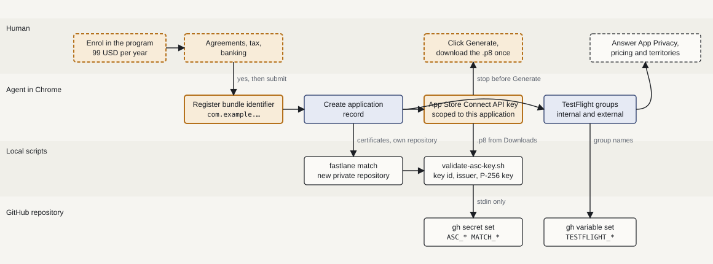

*Apple setup. The agent fills every form; the two ochre gates (bundle identifier, API key) wait for a yes because neither can be undone, and the key download is the human's because the file downloads exactly once. Enrolment and agreements are never the agent's.*

## Google: Play Console

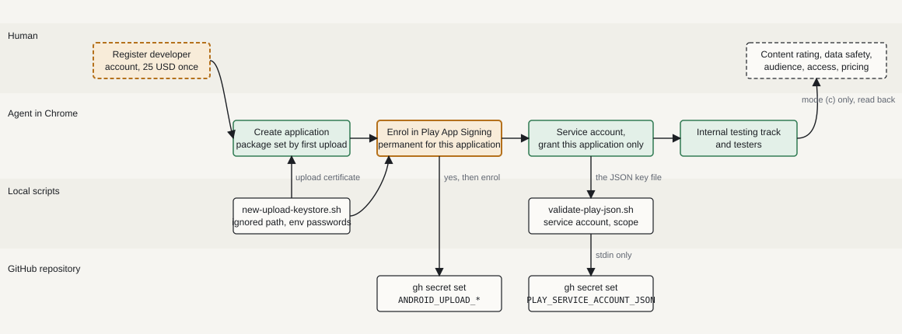

*Google setup. Play App Signing is the one permanent gate; the per-application grant is read back on screen before submit because account-wide access would reach every Blink application. The policy questionnaires are filled only in mode (c), from answers given in that turn.*

## Huawei: AppGallery Connect

Optional third store. The block only opens once uploads to App Store Connect and Google Play work, and every step of it can be marked skipped for an application that does not ship on AppGallery. The pipeline uploads the signed Android bundle and submits it on every tier; the listing, the age rating, the countries and the test user lists stay in the console.

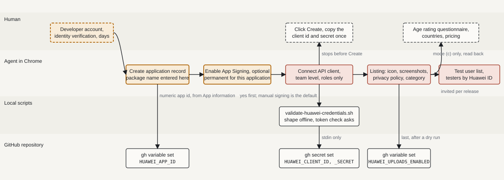

*Huawei setup. App Signing is the permanent gate and is optional: the pipeline signs with the repository's own upload key, so the default is to leave it off. The Connect API client is created at team level and scoped by role, and its secret is shown exactly once; the agent stops before Create and the human pastes both strings into the validator. Nothing in the listing is synced by the pipeline, and testers live on console user lists that must be invited again for each testing version.*

## Delivery once the credentials exist

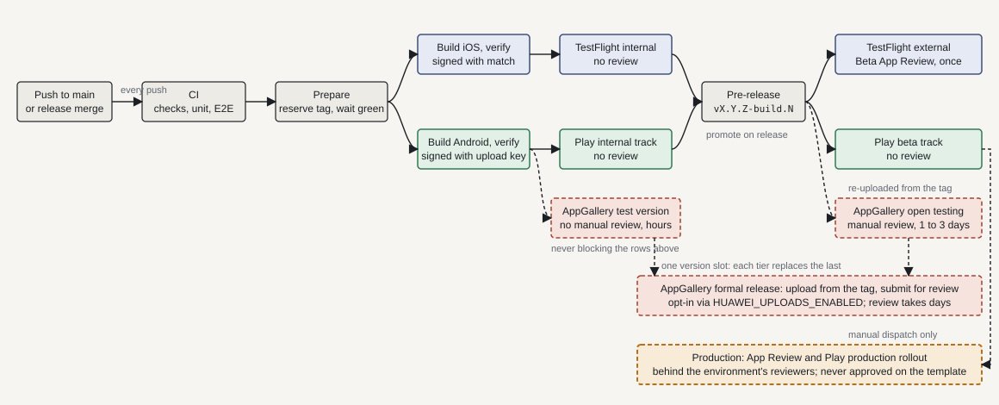

*What the credentials unlock. Every push to main becomes a signed internal build on both stores and a pre-release; a release promotes the same binaries to beta. The template repository stops there: its production environment exists so the flow is real, and is never approved. Huawei AppGallery rides along on all three tiers as an opt-in third store with a single version slot: each tier re-uploads the same signed bundle and submits it in a different flavour, and a version under review makes the next push skip its upload rather than fail. Nothing above the Huawei band waits for it.*

## Conceptual screens

Schematic renderings of the console screens the agent walks through, in the order the reference blocks use them. They show which fields are filled, with what, and where the ochre button means the human clicks. Layouts are conceptual and unbranded; both consoles reorganise their pages, and the click-path in each reference block is the source of truth when a screen differs.

### App Store Connect and the developer portal

#### Register the bundle identifier

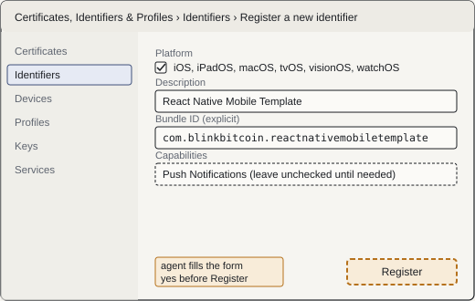

*Developer portal, Identifiers. The agent selects App IDs, fills the description and the explicit bundle identifier, reviews capabilities, and stops before Register: the identifier cannot be deleted once an application record uses it.*

#### Create the application record

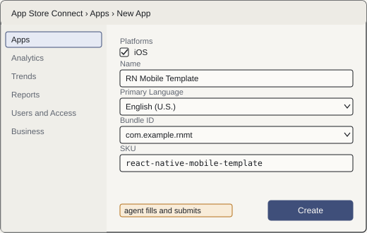

*App Store Connect, Apps, New App. The agent picks the platform, enters the name from the metadata file, the primary language, the bundle identifier registered a step earlier, and the SKU; additive, no gate.*

#### Generate the API key

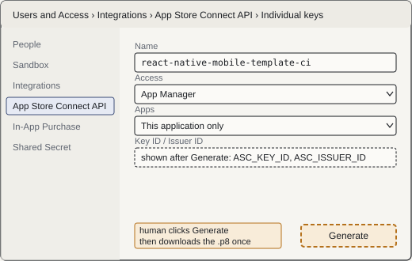

*Users and Access, Integrations, App Store Connect API. The agent names the key and limits access to this application; the human clicks Generate and the .p8 downloads exactly once. The Key ID and Issuer ID on the next screen become two secrets.*

#### TestFlight groups

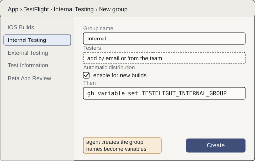

*The application's TestFlight tab. The agent creates the internal group, then the external group and adds the testers the human names. The two group names become repository variables; external testing needs one Beta App Review.*

### Google Play Console and Google Cloud

#### Create the application

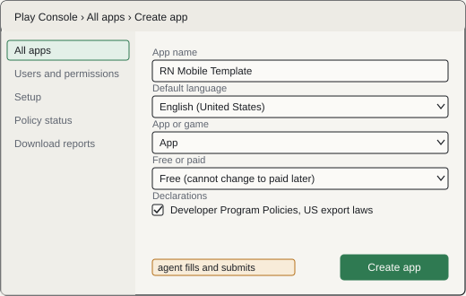

*Play Console, All apps, Create app. Name from the metadata title, default language, app or game, free or paid, and the two declarations. The package name is not entered here: the first upload fixes it forever.*

#### Enrol in Play App Signing

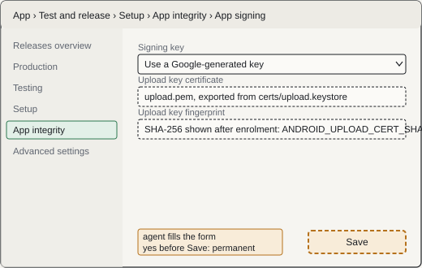

*Test and release, Setup, App integrity, App signing. The agent chooses the Google-generated key and uploads the certificate exported from the local upload keystore; permanent for this application, so it waits for a yes.*

#### Service account and per-application grant

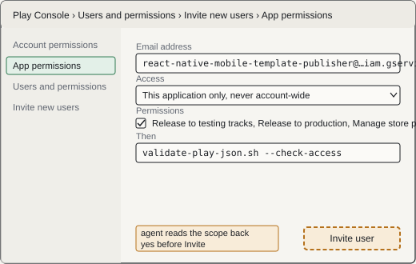

*Two consoles. Google Cloud: IAM and Admin, Service Accounts, create, then Keys, Add key, JSON. Play Console: Users and permissions, Invite new users, paste the account email, select this application only, tick the release and store-presence permissions. The agent reads the app-scope choice back before Invite.*

#### Internal testing track and testers

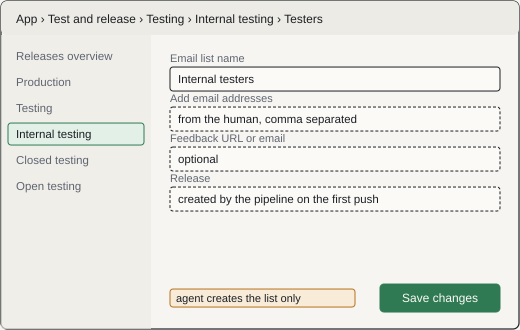

*Test and release, Testing, Internal testing. The agent creates the tester email list from the addresses the human gives and leaves the release itself to the pipeline: the first upload is the delivery workflow's job and is gated.*

### AppGallery Connect

#### Create the application record

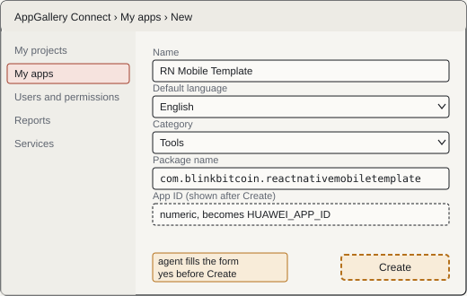

*AppGallery Connect, My apps, New. The package name is entered here and fixes what the record can publish, so the agent reads the form back and waits for a yes. The numeric App ID appears afterwards under App information and becomes the repository variable, not a secret.*

#### Create the Connect API client

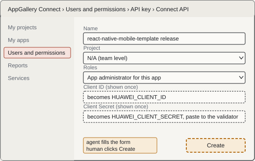

*Users and permissions, API key, Connect API. The agent names the client, keeps Project at N/A so it is team level, and limits the roles; the human clicks Create because the secret is shown exactly once. Both strings go to the validator and then to GitHub on stdin, never to a file in the repository.*

#### Enable App Signing (optional)

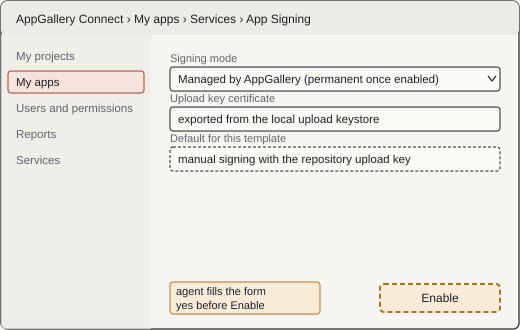

*My apps, Services, App Signing. Optional and permanent once enabled: Huawei re-signs every bundle. The template signs with its own upload key, so the default is to leave this off, and the agent proceeds only on a yes given in that turn.*

#### Submit the uploaded version for release

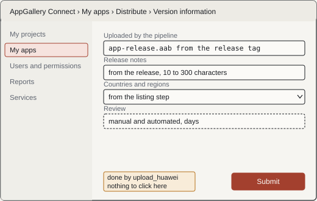

*My apps, Distribute, Version information. This is what the upload_huawei lane does on the production dispatch: the same signed bundle, the release notes, and a submit for review. A human comes here only to check the review state afterwards.*

## Who does what, by mode

The developer picks one mode at the start. The gates in ochre above are the same in every mode: each waits for the word "yes" in the current turn, and a yes to one step is never a yes to the next.

| Kind of step | (a) Browser, pausing | (b) Guided | (c) Browser, end to end |
| --- | --- | --- | --- |
| Navigate and fill forms | agent | human, values supplied | agent |
| Read the form back, then submit | agent, after a yes | human | agent, after a yes |
| Sign in, two-factor codes | human | human | human |
| Download the API key file | human | human | human |
| Agreements, tax, banking, payment | human | human | agent accepts agreements, after a yes; never pays |
| Policy questionnaires | human | human | agent, from answers given in that turn, read back |
| Play App Signing, Huawei App Signing, first Play upload | agent, after a yes | human | agent, after a yes |
| Huawei API client creation | agent fills, human clicks Create | human | agent fills, human clicks Create |
| Test user list and invitations | agent fills, human confirms | human | agent fills, human confirms |
| Validate credentials, push secrets | scripts | scripts | scripts |

### Where each part lives

- `store-setup` owns the mode choice, the 49-step checklist (eight of them the optional Huawei block) in `.store-setup/state.json`, and the identifiers gate that refuses `com.example.*`.
- `store-consoles` owns the 27 console-only steps above as reference blocks, one per step, with the click-path and the confirm class.
- `store-credentials` owns the local validators and `push-to-github.sh`; values reach GitHub only on stdin.
- `store-metadata` owns the listing files and the `sync_metadata` lane; not used by the template repository itself, whose listing stays placeholder for adopters. The Huawei listing is console-only and outside this skill.
